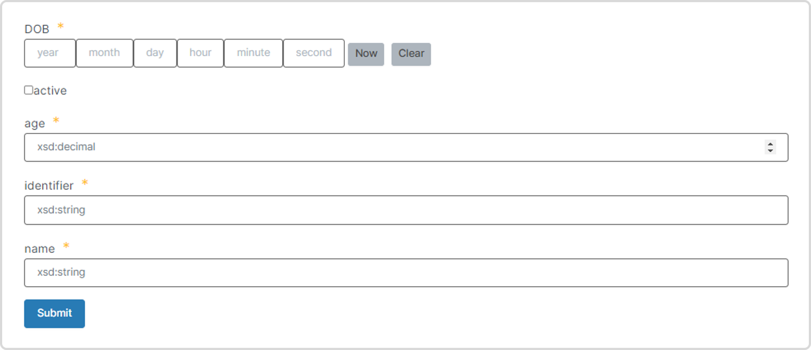

# Use the Document UI SDK

Use the TerminusDB documents User Interface (UI) utility `terminusdb-documents-ui` to automatically generate customizable user interfaces for the document definitions in your TerminusDB schema. The utility takes frames as input and outputs forms in HTML format. A frame is the JSON structure of a JSON document, including the document's inherited properties and IRIs.

### Install and import

Install the utility from `npm`:

```
npm install @terminusdb/terminusdb-documents-ui --save
```

Import the `FrameViewer` component into your code:

```
import {FrameViewer} from '@terminusdb/terminusdb-documents-ui'
```

### The FrameViewer object

Use the `FrameViewer` object of `terminusdb-documents-ui` to configure, customize, and display your forms. `FrameViewer` supports several parameters and functions.

#### FrameViewer parameters

| **Parameter** | **Description**                                                                                              |
| ------------- | ------------------------------------------------------------------------------------------------------------ |
| `frame`       | The JSON frame structure of a TerminusDB schema.                                                             |
| `uiFrame`     | JSON UI properties to customize the appearance of a form.                                                    |
| `type`        | The document type definition in your schema to display the form for.                                         |
| `mode`        | Form modes - `Create`, `Edit`, or `View`.                                                                    |
| `formData`    | The data entered into or provided for a form. Specify `formData` in `Edit` and `View` modes to display data. |
| `hideSubmit`  | Hide the `Submit` button to show view-only data.                                                             |

#### FrameViewer functions

| **Function**    | **Description**                                                                                      |
| --------------- | ---------------------------------------------------------------------------------------------------- |
| `onSubmit`      | A customizable JavaScrpt (JS) callback function to process data submitted via a form.                |
| `onChange`      | A customizable JS callback function to process data when form data is changed.                       |
| `onSelect`      | JS callback function to retrieve the selected values from a `Select` component.                      |
| `onTraverse`    | Return the ID of a document on a click event. Useful for binding an `onClick` event with a document. |
| `FieldTemplate` | Customize the appearance of a form.                                                                  |

### FrameViewer common usage

A common use of `terminusdb-documents-ui` is as follows:

1. Set **** up a Webpack.
2. Use the [TerminusDB JavaScript client](../../guides/reference-guides/javascript-client-reference/woqlclient.md).
3. Use the client function `getSchemaFrame` to retrieve frame data from a TerminusDB database.
4. Set custom values and behaviour for `FrameViewer` parameters and functions as required.
5. Call `FrameViewer` to display frame data in the specified form.

### Get schema frame data from a database

A basic example below to get started with a TerminusDB JavaScript client.

```javascript
const TerminusDBClient = require("@terminusdb/terminusdb-client");

import {FrameViewer} from '@terminusdb/terminusdb-documents-ui'

try {
    let type = "Person" // type is the a document class of interest
    let frames = await woqlClient.getSchemaFrame(type, woqlClient.db())
    console.log(`Frames generated from ${woqlClient.db()}`, frames)
} catch(err) {
    console.log("Error fetching frames", err)
}
```

### FrameViewer usage step-by-step

Use three simple steps - input, configure, and output:

[Step 1. Create frame data](./#step-1.-create-frame-data)

[Step 2. Configure properties and functions](./#step-2.-configure-properties-and-functions)

[Step 3. Generate the form](./#step-3.-generate-the-form)

#### Step 1. Create frame data

For simplicity, all examples use the `frames` definition below consisting of one document `Person`.

```javascript
let frames = {
   "@context": {
        "@base": "terminusdb:///data/",
        "@schema": "terminusdb:///schema#",
        "@type": "@context"
   },
   "Person": {
        "@key": {
            "@type": "Random"
        },
        "@type": "Class",
        "DOB": "xsd:dateTime",
        "active": "xsd:boolean",
        "age": "xsd:decimal",
        "name": "xsd:string"
    }
}

// The document to display the frame for. 

let type = "Person"
```

#### Step 2. Configure properties and functions

The example below generates an empty frame for the attributes of the `Person` document. The callback function `handleSubmit` displays any user-entered form data. Add functionality to `handleSubmit` to suit your requirements. The `uiFrames` parameter in the example adds customizations for your forms. See Customize the looks and feel of frames for details.

```javascript
// Create a place holder for the "Person" "name" property.

let uiFrames = {
    "name" : {
        "placeholder": "Please enter a name ..."
    }
}

// Mode "Create" displays an empty frame.

let mode = "Create"

// Callback to display form data.

function handleSubmit(data) {
    console.log("Form data: ", data)
}
```

#### Step 3. Generate the form

Generate the form using the properties and functions defined in the previous step.

```javascript
// Generate the form.

return <FrameViewer
    frame = {frames}
    uiFrame = {uiFrames}
    type = {type}
    onSelect = {handleSelect}
    mode = {mode}
    onSubmit = {handleSubmit}/>
```

**Screen-print/s of the output:**



### FrameViewer modes

The `FrameViewer` object supports three modes:

* [Create](./#create-mode)
* [Edit](./#edit-mode)
* [View](./#view-mode)

#### Create mode

The `Create` mode displays an empty frame as demonstrated in the previous example.

#### Edit mode

The `Edit` mode displays populated and empty frames. This mode requires the `formData` parameter.

```javascript
// Mode "Edit" displays a frame with editable data.

let mode = "Edit"

// Add form data to populate the frame.

let formData = {
	"@id": "Person/John%20Doe",
	"@type": "Person",
	first_name: "John",
	last_name: "Doe",
	age: "17",
	active: true,
	DOB: "2022-03-31T10:01:11.000Z"
}

// Callback to display form data.

function handleSubmit(data) {
    console.log("Form data: ", data)
}

// Generate the form with formData paramter.

return <FrameViewer
    frame = {frames}
    type = {type}
    onSelect = {handleSelect}
    mode = {mode}
    formData = {formData}
    onSubmit = {handleSubmit}/>
```

**Screen-print/s of the output:**

.PNG>)

#### View Mode

The `View` mode displays populated frames for view-only - the **Submit** button is automatically hidden. If the `formData` parameter is omitted, an empty form is displayed.

```javascript
// Mode "View" displays populated frames.

let mode = "View"

// Add form data to populate the frame.

let formData = {
	"@id": "Person/John%20Doe",
	"@type": "Person",
	first_name: "John",
	last_name: "Doe",
	age: "17",
	active: true,
	DOB: "2022-03-31T10:01:11.000Z"
}

// Callback to display form data.

function handleSubmit(data) {
    console.log("Form data: ", data)
}

// Generate the form with formData paramter.

return <FrameViewer
    frame = {frames}
    type = {type}
    onSelect = {handleSelect}
    mode = {mode}
    formData = {formData}
    onSubmit = {handleSubmit}/>
```

**Screen-print/s of the output:**

.PNG>)

### Further Reading

The Document UI SDK reference guide:

****[**Documents UI SDK data types**](documents-user-interface-data-types.md).

****[**Documents UI SDK customization**](documents-user-interface-customization.md)**.**

****[**Documents UI SDK Geographic Maps**](documents-user-interface-geographic-maps.md)**.**

****[**TerminusDB JavaScript client reference guide**](../../guides/reference-guides/javascript-client-reference/woqlclient.md)**.**
