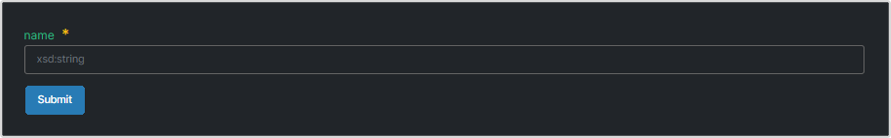
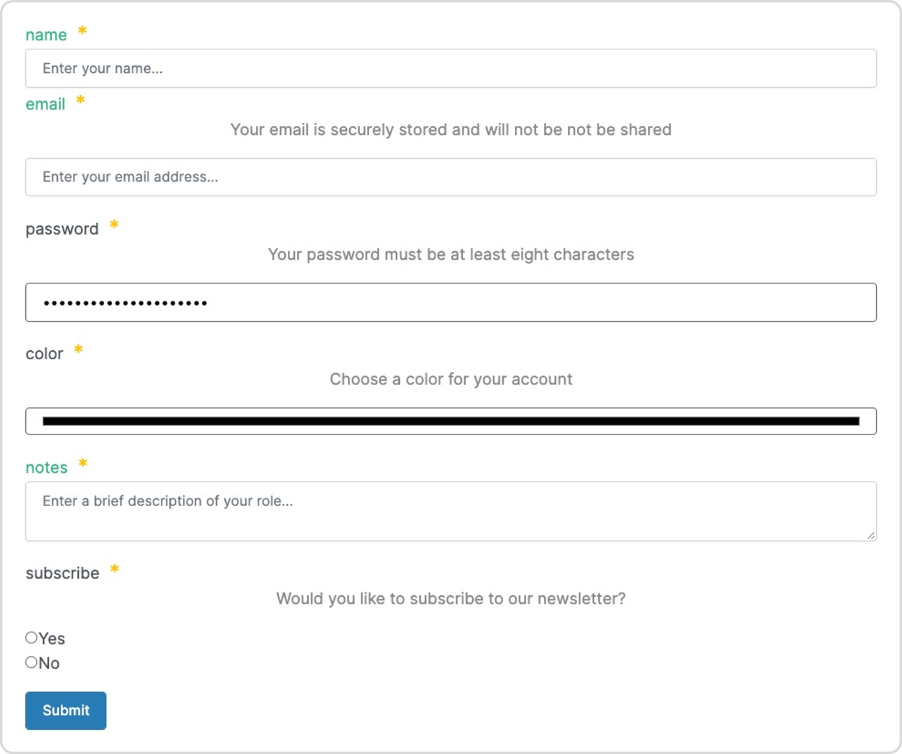
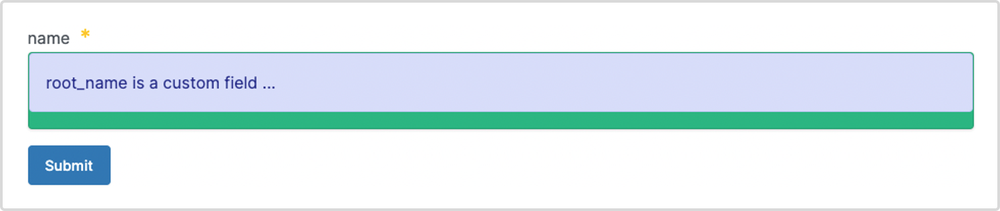

# Documents UI SDK Customization

Customize the look and feel of your forms with styles, widgets, and additional information.

[**To get started read the Document UI SDK how-to guide**](./)****

## The uiFrames parameter

Use the `uiFrames` parameter of the `FrameViewer` component to customize the look and feel of your forms. `uiFrames` supports two types of customizable properties:

* Property `classNames` applicable to forms and fields.
* Properties prefixed `ui:` applicable to fields only.

## uiFrames classNames property

Use the `classNames` property to apply **CSS** or **react** bootstrap styles to your entire form or fields of a document.

### uiFrames classNames example

The example below specifies the background color of the form using the `className` styles `bg-dark p-5`, and applies the style `text-green` to the `name` field of the `Person` document. Where a document property is not specified, the style is applied to the entire form. Note the style `bg-dark` is a React bootstrap class name.

```javascript
let frames = {
    "@context": {
        "@base": "terminusdb:///data/",
        "@schema": "terminusdb:///schema#",
        "@type": "@context"
    },
    "Person": {
        "@key": {
            "@type": "Random"
        },
        "@type": "Class",
        "name": "xsd:string"
    }
}

// uiFrames configuration here

let uiFrames = {
   classNames: "bg-dark p-5",
   name: {
      classNames: "text-green"
   }
}

let type = "Person"
let mode = "Create"

return <FrameViewer
    frame= {frames}
    uiFrame= {uiFrames} // uiFrames parameter here
    type= {type}
    mode= {mode}/>
```

**Screen-print/s of the output:**



## uiFrames ui: prefixed properties

The `uiFrames` parameter supports several customizable properties and widgets prefixed `ui:` and `ui:widget` respectively.

### ui: prefixed properties

Summary of `ui:` prefixed properties.

| **Property**    | **Description**                                 | **Example**                                                                                                 |
| --------------- | ----------------------------------------------- | ----------------------------------------------------------------------------------------------------------- |
| **description** | Add a field description.                        | `name: { "ui:description": "A person's first name" }`                                                       |
| **placeholder** | Add instructions in a field.                    | `name: { "ui:placeholder": "Please enter your name" }`                                                      |
| **order**       | Specify the order in which fields are rendered. | `"ui:order": ["name", "DOB", "email"]` or `"ui:order": ["name", "*"]` to ensure `"name"` is rendered first. |

### ui:widget prefixed properties

Summary of `ui:widget` prefixed properties.

| **Property** | **Description**                                                                       | **Example**                             |
| ------------ | ------------------------------------------------------------------------------------- | --------------------------------------- |
| **hidden**   | Hide a field.                                                                         | `name: { "ui:widget": 'hidden' }`       |
| **radio**    | Create a **Yes** (true) or **No** (false) radio button for a `boolean` field.         | `subscribe: { "ui:widget": 'radio' }`   |
| **select**   | Create a **Yes** (true) or **No** (false) select/dropdown list for a `boolean` field. | `subscribe: { "ui:widget": 'select' }`  |
| **textarea** | Create a text area for multiline input.                                               | `bio: { "ui:widget": 'textarea' }`      |
| **password** | Create obfuscated password entry.                                                     | `password: { "ui:widget": 'password' }` |
| **color**    | Create a color picker.                                                                | `color: { "ui:widget": 'color' }`       |

### Boolean data types

By default, a field of data type `boolean` is rendered as a checkbox.

### Example demonstrating all properties

```javascript
let frames = {
   "@context": {
        "@base": "terminusdb:///data/",
        "@schema": "terminusdb:///schema#",
        "@type": "@context"
    },
    "Person": {
        "@key": {
            "@type": "Random"
        },
        "@type": "Class",
        "name": "xsd:string",
        "email": "xsd:string",
        "password": "xsd:string",
        "color": "xsd:string",
        "notes": "xsd:string",
        "subscribe": "xsd:boolean",
        "created": "xsd:dateTime",
        "modified": "xsd:dateTime",
   }
}

let uiFrames = {
    created: {
        "ui:widget": 'hidden'
    },
    modified: {
        "ui:widget": 'hidden'
    },
    name: {
        classNames: "text-green",
        "ui:placeholder": "Enter your name..."
    },
    email: {
        classNames: "text-green",
        "ui:description": "Your email is securely stored and will not be not be shared",
        "ui:placeholder": "Enter your email address..."
    },
    password: {
        "ui:widget": 'password',
        "ui:description": "Your password must be at least eight characters",
        "ui:placeholder": "Enter your password..."
    },
    color: {
        "ui:widget": 'color',
        "ui:description": "Choose a color for your account"
    },
    notes: {
        classNames: "text-green",
        "ui:widget": 'textarea',
        "ui:placeholder": "Enter a brief description of your role..."
    },
    subscribe: {
        "ui:widget": 'radio',
        "ui:description": "Would you like to subscribe to our newsletter?"
    },
    "ui:order": ["name", "email", "password", "*"]
}

let type = "Person"
let mode = "Create"

return <FrameViewer
    frame = {frames}
    uiFrame = {uiFrames}
    type = {type}
    mode = {mode}/>
```

**Screen-print/s of the output:**



## Customize sets and lists

Apply widgets to sets and lists. The example below hides the set `nickName`.

```javascript
let frames = {
    "@context": {
        "@base": "terminusdb:///data/",
        "@schema": "terminusdb:///schema#",
        "@type": "@context"
    },
    "Person": {
        "@key": {
            "@type": "Random"
        },
        "@type": "Class",
        "name": "xsd:string",
        "nickName": {
		    "@class": "xsd:string",
			"@type": "Set"
		}
    }
}

let uiFrames = {
   nickName: {
      "ui:widget": 'hidden'
   }
}

let type = "Person"
let mode = "Create"

return <FrameViewer
    frame= {frames}
    uiFrame= {uiFrames}
    type= {type}
    mode= {mode}/>
```

## Custom widgets

Develop react functions to create custom widgets.

```javascript
let frames = {
    "@context": {
        "@base": "terminusdb:///data/",
        "@schema": "terminusdb:///schema#",
        "@type": "@context"
    },
    "Person": {
        "@key": {
            "@type": "Random"
        },
        "@type": "Class",
        "name": "xsd:string"
    }
}

// React function to create a custom widget

function renderNameField(props) {
   return <Card bg = "success">
      <Alert>{"`${props.id}` is a custom field ..."}</Alert>
   </Card>
}

let uiFrames = {
   name: {
      "ui:widget": renderNameField
   }
}

let type = "Person"
let mode = "Create"

return <FrameViewer
    frame= {frames}
    uiFrame= {uiFrames}
    type= {type}
    mode= {mode}/>
```

**Screen-print/s of the output:**



## Further Reading

****[**Get started with the Document UI SDK**](./)****

****[**Document UI SDK Data Types**](documents-user-interface-data-types.md)****

****[**Document UI SDK Geographic Maps**](documents-user-interface-geographic-maps.md)
