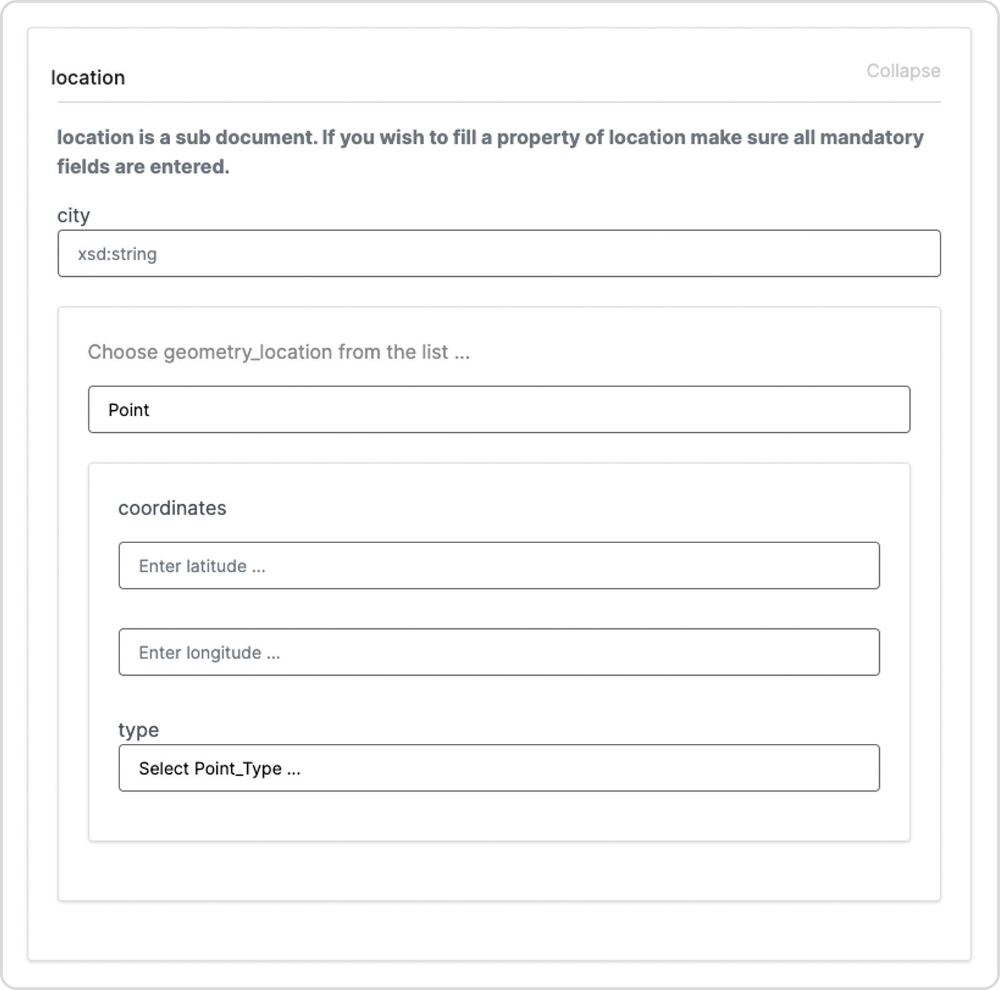
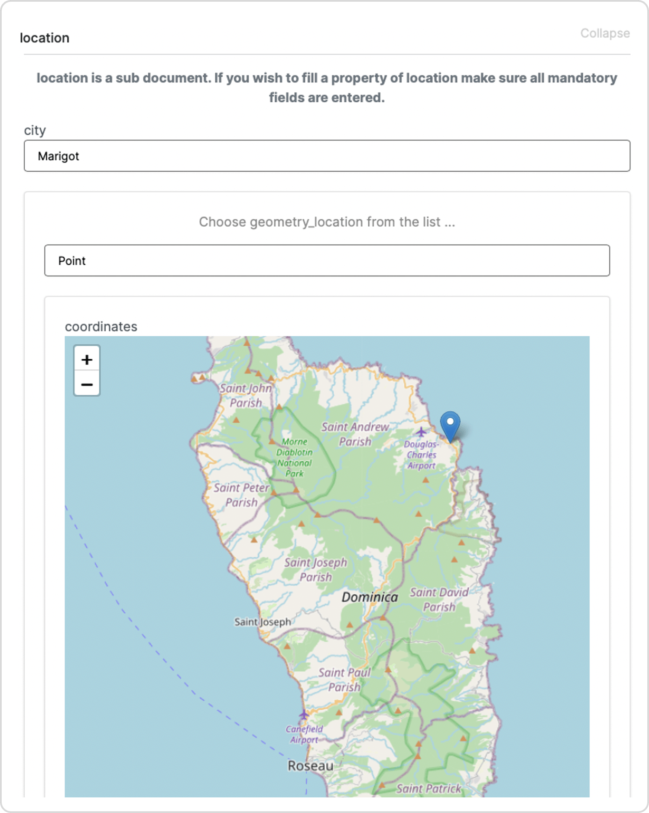
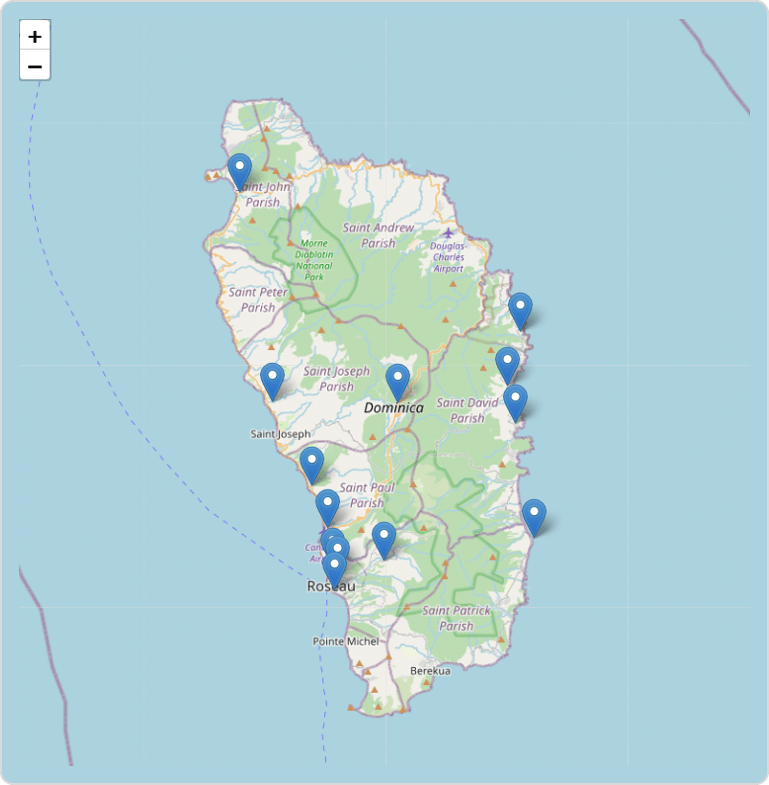

# Documents UI SDK Maps

Use the `FrameViewer` object of `terminusdb-documents-ui` to automatically generate forms to enter map coordinates and display/embed visual maps for those coordinates in your forms. Use the `MapViewer` object (`View` mode only) to display maps with configurable zoom and scroll functionality.

## FrameViewer and MapViewer objects

| **Object**    | **Modes supported**                                                  | **Import**                                                        | **Details**                                                   |
| ------------- | -------------------------------------------------------------------- | ----------------------------------------------------------------- | ------------------------------------------------------------- |
| `FrameViewer` | <p><code>Create</code><br><code>Edit</code><br><code>View</code></p> | `import {FrameViewer} from '@terminusdb/terminusdb-documents-ui'` | [Generate forms and maps using FrameViewer](broken-reference) |
| `MapViewer`   | `View`                                                               | `import {MapViewer} from '@terminusdb/terminusdb-documents-ui'`   | [Display maps using MapViewer](broken-reference)              |

## Generate forms and maps using FrameViewer

Use `FrameViewer` in `Create` or `Edit` mode to create a form and enter map coordinates respectively.

### Create a form to enter map coordinates

The example below creates a form defining coordinates representing latitude and longitude as `xsd:decimal` fields.

```javascript
let frames = {
	"@context": {
		"@base": "terminusdb:///data/",
		"@schema": "",
		"@type": "@context"
	},
	"coordinates": {
		"location": {
			"@class": "Location",
			"@subdocument": []
		}
	},
	"Location": {
		"@key": {
			"@type": "Random"
		},
		"@subdocument": [],
		"@type": "Class",
		"city": "xsd:string",
		"geometry_location": {
			"@class": [
				{
					"@class": "Point",
					"@subdocument": []
				}
			],
			"@type": "Optional"
		}
	},
	"Point": {
		"@key": {
			"@type": "Random"
		},
		"@subdocument": [],
		"@type": "Class",
		"coordinates": {
			"@class": "xsd:decimal",
			"@dimensions": 1,
			"@type": "Array"
		},
		"type": {
			"@id": "Point_Type",
			"@type": "Enum",
			"@values": [
				"Point"
			]
		}
  	},
  	"Point_Type": {
		"@type": "Enum",
		"@values": [
			"Point"
    	]
	}
}

let type = "coordinates"
let mode = "Create"

return <FrameViewer
    frame = {frames}
    type = {type}
    mode = {mode}/>
```

**Screen-print/s of the output:**



### View the map

In `View` mode, `FrameViewer` displays a visual map for coordinates entered in `Edit` mode. In the example below, the `formData` parameter simulates data entered into the form in `Edit` mode.

```javascript
// Use the `frames` definition above

let formData = {
	"@id": "coordinates/908cdf8db2fa9f843f063669171280eb448e3403d837cb440726ab394043e918",
  	"@type": "coordinates",
	"location": {
		"@id": "coordinates/908cdf8db2fa9f843f063669171280eb448e3403d837cb440726ab394043e918/coordinates/Location/cbf3d8956432778d2c3db84533eac02bff76326aa3407436e483361fdf55fd0c",
		"@type": "Location",
		"city": "Marigot",
		"geometry_location": {
			"@id": "coordinates/location/Location/cbf3d8956432778d2c3db84533eac02bff76326aa3407436e483361fdf55fd0c/geometry_location/Point/3ec3de24dab9a66311ff5010df341b05d67bbcd764537f6f3484a8d03d235843",
			"@type": "Point",
			"coordinates": [
				15.53743,
				-61.282
			],
			"type": "Point"
		}
	}
}

let type = "coordinates"
let mode = "View"

return <FrameViewer
    frame = {frames}
    formData = {formData}
    type = {type}
    mode = {mode}/>
```

**Screen-print/s of the output:**



## Display maps using MapViewer

Use `MapViewer` to display maps with configurable zoom and scroll functionality.

### MapViewer parameters

| **Parameter**     | **Type** | **Description**                                                              |
| ----------------- | -------- | ---------------------------------------------------------------------------- |
| `documents`       | Array    | TerminusDB document/s retrieved using a WOQL Query or defined in a constant. |
| `zoom`            | Integer  | Set the maximum zoom-in level.                                               |
| `scrollWheelZoom` | Boolean  | Enable/disable zoom in/out.                                                  |

### MapViewer document structure

TerminusDB documents retrieved using a WOQL query must converted to the structure below.

```javascript
let docId = "id of doc ..."
let docName = "name of doc ..."
let lat = -61.23 // a valid decimal value to display latitude
let lng = 15.42 // a valid decimal value to display longitude
let docs = [
    {
        id : docId,
        name : docName,
        lat : lat,
        lng : lng
    },
    { ... },
    { ... }
]
```

### MapViewer example

```javascript
let docs = [
   {
      "id": "Asset/Communication%20tower%20near%20Good%20Hope%20",
      "lng":-61.2554,
      "name": "Communication tower near Good Hope ",
      "lat":15.4125
   },
   {
      "id": "Asset/La%20Plaine%20Police%20Station",
      "lng":-61.2416,
      "name": "La Plaine Police Station",
      "lat":15.333
   },
   {
      "id": "Asset/Mahaut%20River%20Health%20Centre",
      "lat":15.4773,
      "name": "Mahaut River Health Centre",
      "lng":-61.2516
   },
   {
      "id": "Asset/Belles%20Primary%20School",
      "lat":15.42717,
      "name": "Belles Primary School",
      "lng":-61.3403
   },
   {
      "id": "Asset/Trafalgar%20hydro%20power%20plan%20",
      "lat":15.316919,
      "name": "Trafalgar hydro power plan ",
      "lng":-61.35083
   },
   {
      "id": "Asset/Fort%20Young%20Hotel%20",
      "lat":15.296,
      "name": "Fort Young Hotel ",
      "lng":-61.38627
   },
   {
      "id": "Asset/Roseau-Canefield%20Airport",
      "lat":15.33934,
      "name": "Roseau-Canefield Airport",
      "lng":-61.39179
   },
   {
      "id": "Asset/Princess%20Margaret%20Hospital%20",
      "lat":15.30705,
      "name": "Princess Margaret Hospital ",
      "lng":-61.3847
   },
   {
      "id": "Asset/Justin%20Fadipe%20Hospital",
      "lat":15.4281,
      "name": "Justin Fadipe Hospital",
      "lng":-61.4316
   },
   {
      "id": "Asset/Dominica%20Air%20&%20Sea%20Ports%20Authority%20(DASPA)",
      "lng":-61.3881,
      "name": "Dominica Air & Sea Ports Authority (DASPA)",
      "lat":15.3124
   },
   {
      "id": "Asset/Petro%20Caribe%20Radio%20Tower",
      "lng":-61.40316,
      "name": "Petro Caribe Radio Tower",
      "lat":15.3695
   },
   {
      "id": "Asset/Portsmouth%20Town%20Council",
      "lng":-61.4553,
      "name": "Portsmouth Town Council",
      "lat":15.574671
   },
   {
      "id": "Asset/Castle%20bruce%20Electrical%20substation",
      "lat":15.4393,
      "name": "Castle bruce Electrical substation",
      "lng":-61.2607
   },
   {
      "id": "Asset/NEW%20ASSET%20",
      "lat":53.307481,
      "name": "NEW ASSET ",
      "lng":-62.954872
   },
   {
      "id": "Asset/TCD",
      "lng":-62.5449,
      "name": "TCD",
      "lat":53.3439
   }
]

return <MapViewer
    documents = {docs}
    zoom = {5}
    scrollWheelZoom = {true}/>
```

**Screen-print/s of the output:**



## Further Reading

****[**Get started with the Document UI SDK**](./)****

****[**Document UI SDK Customization**](documents-user-interface-customization.md)****

****[**Document UI SDK Data Types**](documents-user-interface-data-types.md)****
