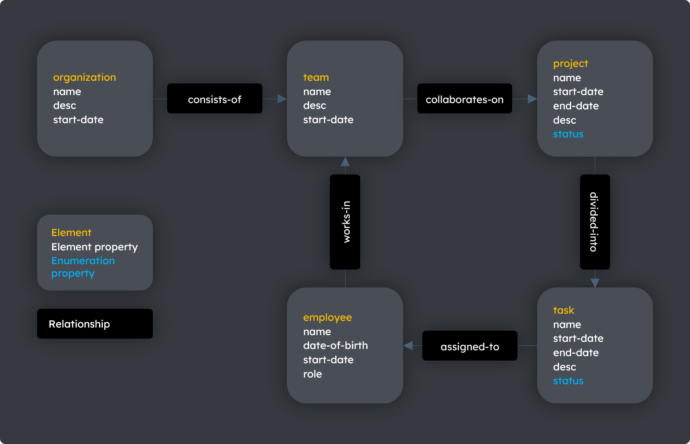

# Data Modeling Basics

## The importance of data modeling

The correct organization of data and the correct definition of the underlying database model or schema are critical to a business. TerminusDB organizes data in an object structure to facilitate modeling a business and the real world generally.

## Modeling an organization

Using a small organization as an example, use the steps below to model and define a schema for the `organization` and its **elements** - `team`, `project`, `task`, and `employee`.

**Data modeling steps**

[Step 1. Identify the elements of the organization](data-modeling-basics.md#step-1.-identify-the-elements-of-the-organization)

[Step 2. Identify the properties of each element](data-modeling-basics.md#step-2.-identify-the-properties-of-each-element)

[Step 3. Identify the relationships between elements](data-modeling-basics.md#step-3.-identify-the-relationships-between-elements)

### Element relationship modeling

For relational and graph databases, an entity or element relationship model is a good way of implementing these steps. This helps to identify the components of the schema - its **elements**, **properties**, and **relationships**.

#### Diagram: An element relationship model

### Step 1. Identify the elements of the organization


**Elements** are similar to entities in relational database terminology.


#### Table: Elements of an organization

| **Element**    | **Description**                      |
| -------------- | ------------------------------------ |
| `organization` | The main organization.               |
| `team`         | The teams within the `organization.` |
| `employee`     | The employee assigned to `task`.     |
| `project`      | The projects that a `team` creates.  |
| `task`         | The tasks of the `project`.          |

### Step 2. Identify the properties of each element


**Properties** are similar to attributes in relational database terminology. A property is an item of data describing the element.


#### Table: The properties of elements

<table data-header-hidden><thead><tr><th width="292"></th><th></th></tr></thead><tbody><tr><td><strong>Element</strong></td><td><strong>Properties</strong></td></tr><tr><td><code>organization</code></td><td><code>name</code>, <code>desc</code>, <code>start-date</code></td></tr><tr><td><code>team</code></td><td><code>name</code>, <code>desc</code>, <code>start-date</code></td></tr><tr><td><code>employee</code></td><td><code>name</code>, <code>date-of-birth</code>, <code>start-date</code>, <code>role</code></td></tr><tr><td><code>project</code></td><td><code>name</code>, <code>start-date</code>, <code>end-date</code>, <code>desc</code>, <code>status</code></td></tr><tr><td><code>task</code></td><td><code>name</code>, <code>start-date</code>, <code>end-date</code>, <code>desc</code>, <code>status</code></td></tr></tbody></table>

### Step 3. Identify the relationships between elements


**Relationships** are the same in graph and relational database terminology. Relationships define the associations or interactions between elements.


#### Table: The relationship between elements

<table data-header-hidden><thead><tr><th width="176"></th><th width="129"></th><th width="195"></th><th></th></tr></thead><tbody><tr><td><strong>Element</strong></td><td><strong>Element</strong></td><td><strong>Relationship (phrasal verb)</strong></td><td><strong>Relationship description</strong></td></tr><tr><td><code>organization</code></td><td><code>team</code></td><td><code>consists-of</code></td><td>An <code>organization</code> <code>consists of</code> <code>team</code>s</td></tr><tr><td><code>team</code></td><td><code>project</code></td><td><code>collaborates-on</code></td><td>A <code>team</code> <code>collaborates-on</code> <code>project</code>s</td></tr><tr><td><code>project</code></td><td><code>task</code></td><td><code>divided-into</code></td><td>A <code>project</code> is <code>divided-into</code> <code>task</code>s</td></tr><tr><td><code>task</code></td><td><code>employee</code></td><td><code>assigned-to</code></td><td>A <code>task</code> is <code>assigned-to</code> an <code>employee</code></td></tr></tbody></table>

