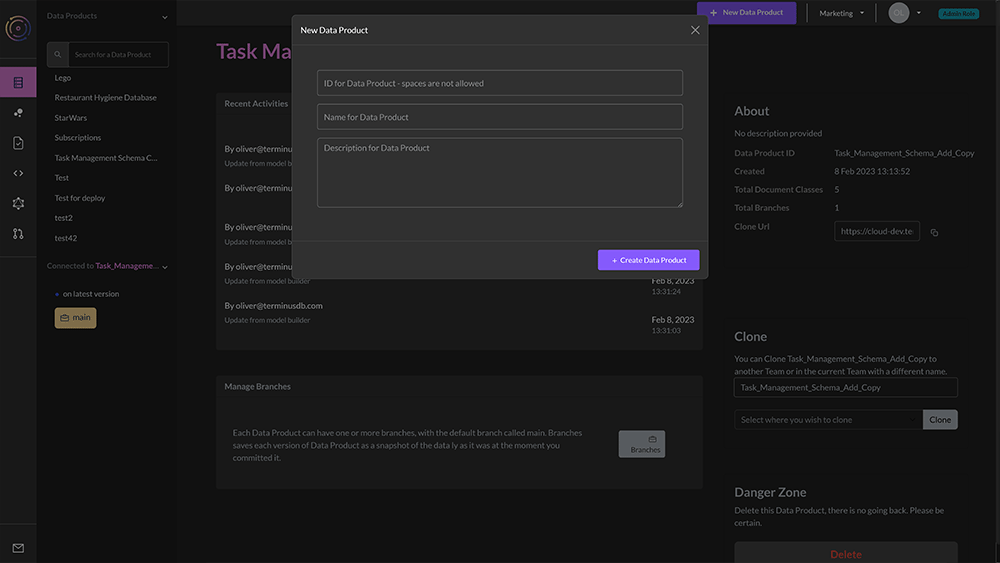
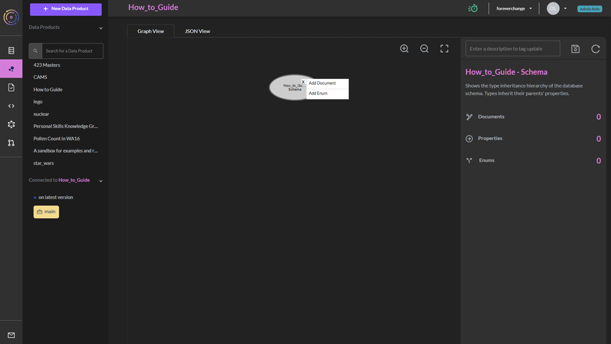
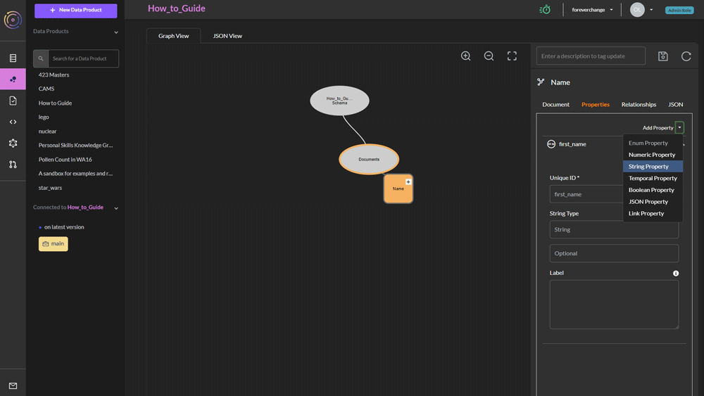
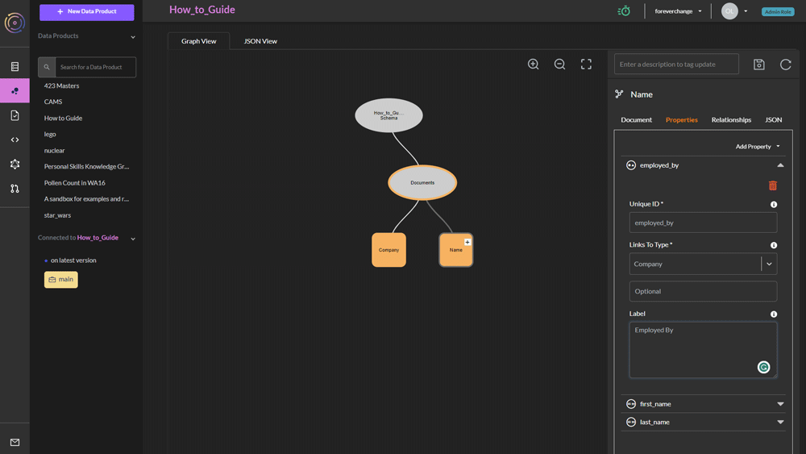
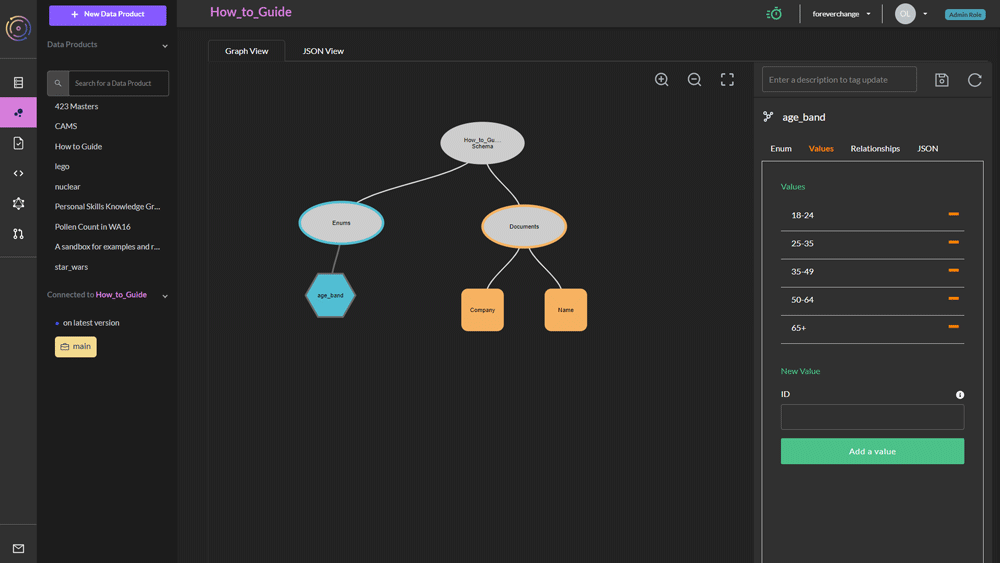
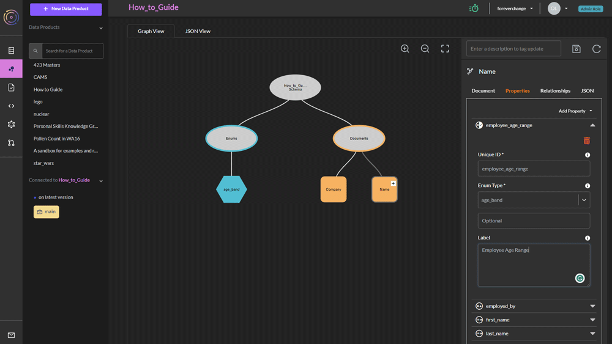

# Use the Model Builder UI

### Make a New Data Product

First, log in to TerminusCMS, choose (or create) a team, and then click on `New Data Product`.

<figure><figcaption></figcaption></figure>

### Create a Class

Now click on the pink bubbles on the left panel. This takes you to the schema builder page.

Hover over the gray schema bubble in the center of the graph view.

<figure><figcaption></figcaption></figure>

This will give you a `+` icon. This will allow you to add either a document class or an enum. Choose _document_.

The document will appear as an orange Square and on the right-hand side you will have a panel for editing the schema. You can choose a name for your new document class under the field `Unique ID*`.

Once you have chosen an id, you can (optionally) choose the _printed_ name of the document under `Label`.

### Add Properties

<figure><figcaption></figcaption></figure>

Now you can switch the properties tab, and click on `Add Property`. This will give you a choice of several different property types. You can choose `String` for instance for various string properties.

Again you will have to give it a unique id, and by default the property will be _optional_, but you can change this to _mandatory_, _list_ or _set_.

When you are done, click the Disk icon above (meaning save).

### Add Link Property

<figure><figcaption></figcaption></figure>

You can also add a link property by choosing `Link Property` under the `AddProperty` selector once you have saved at least one document class.

You must again specify an ID, and link to an already created document class.

### Add Enum

<figure><figcaption></figcaption></figure>

You can add an enum by clicking the `+` on the gray schema bubble and selecting `Add Enum`.

After you have chosen a name for your enum, click on the `Values` tab on the right, and begin entering valid values for this enum.

### Add an Enum Property

<figure><figcaption></figcaption></figure>

Now it is possible to link to this enum from any document class. You can do this by selecting `Enum Property` under the `AddProperty` selector.
