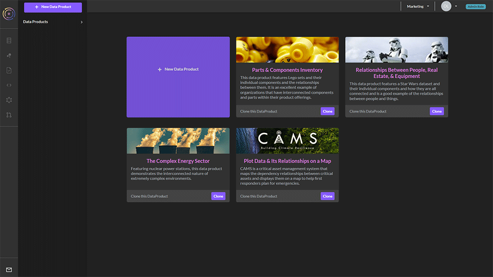
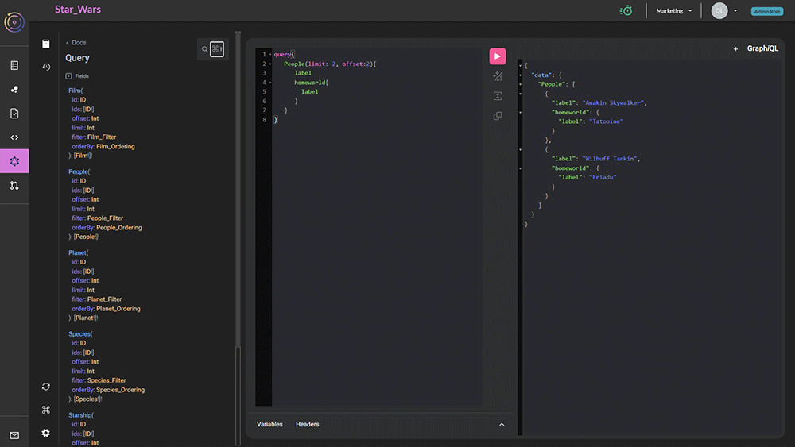

# GraphQL Basics


To use this How-To, first [clone the Star Wars demo](../cloning-a-demo-project.md) into your team on TerminusCMS. You will then have full access to the data needed for this tutorial


<figure><figcaption></figcaption></figure>

Once you have cloned the database, go to the GraphQL icon (triangle in hexagon) on the left-hand side and select the filing cabinet icon

<figure><figcaption></figcaption></figure>

Now you will have two panels, one on the left for query, and one on the right for results.

### Entering a query

First type `query{` into the query panel. It should look like this:

```graphql
query{
   █
}
```

If at the cursor point you type: `Ctrl-c` you'll get a list of options you can choose from. These options are legal GraphQL syntax according to your provided schema. Let's search for people from the Star Wars universe.

```graphql
query{
   People{
      label
   }
}
```

The `label` property in this schema supplies the name of the person we are interested in. Of course, this query might give us a bit too much, so let us also limit it.

```graphql
query{
   People(limit: 5){
      label
   }
}
```

This should result in:

```json
{
  "data": {
    "People": [
      {
        "label": "Luke Skywalker"
      },
      {
        "label": "Obi-Wan Kenobi"
      },
      {
        "label": "Anakin Skywalker"
      },
      {
        "label": "Wilhuff Tarkin"
      },
      {
        "label": "Chewbacca"
      }
    ]
  }
}
```

To get more fields in our query, we can just add words, using `Ctrl-c` if we are stuck for names of fields.

```graphql
query{
   People(limit: 5){
      label
   }
}
```

When following links to other objects, we have to embed a query inside our query. So, for instance, if we want to know the homeworld that each of these people comes from we can write:

```graphql
query{
   People(limit: 2){
      label
      homeworld{
        label
      }
   }
}
```

This will get us:

```json
{
  "data": {
    "People": [
      {
        "label": "Luke Skywalker",
        "homeworld": {
          "label": "Tatooine"
        }
      },
      {
        "label": "Obi-Wan Kenobi",
        "homeworld": {
          "label": "Stewjon"
        }
      }
    ]
  }
}
```

### Paging

If we want to page the results, we can also add an offset to our query, and we'll get _the next_ results.

```graphql
query{
   People(limit: 2, offset:2){
      label
      homeworld{
        label
      }
   }
}
```

And now we get two more:

```json
{
  "data": {
    "People": [
      {
        "label": "Anakin Skywalker",
        "homeworld": {
          "label": "Tatooine"
        }
      },
      {
        "label": "Wilhuff Tarkin",
        "homeworld": {
          "label": "Eriadu"
        }
      }
    ]
  }
}
```
