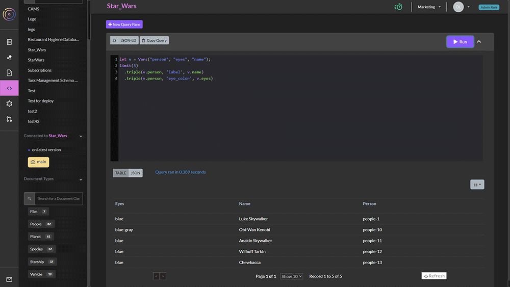

# WOQL Query Basics


To use this How-To, first [clone the Star Wars demo](../cloning-a-demo-project.md) into your team on TerminusCMS. You will then have full access to the data needed for this tutorial


### Writing a WOQL Query

<figure><figcaption></figcaption></figure>

First, go to the WOQL Query Panel in the UI. Now you can type a query using the syntax of the JS client in the panel.

Queries are composed of variables, names, words and values.

Let's start with a simple query which just looks at one field.

We need to describe which variables we want to use, and we do that with `Vars`.

Next, we add the `limit` word, to limit to 10 entries.

Then we complete the query with a `triple` word, using the `source` variable, the `label` field, and the `destination` variable.

```javascript
let v = Vars("source", "destination");
limit(10).triple(v.source, 'label', v.destination)
```

The results will come back in a table below in the UI. In the client it will return as a list of JSON objects, having each of the variables described in `Vars` bound.

The `destination` variable is filled with elements of type _string_, because `label` always terminates in a string. However we can also add other fields to our object, to search for more information by chaining `triple` together.

```javascript
let v = Vars("person", "eyes", "name");
limit(5)
  .triple(v.person, 'label', v.name)
  .triple(v.person, 'eye_color', v.eyes)
```

This query results in the following:

| Name             | Eyes      | Person    |
| ---------------- | --------- | --------- |
| Luke Skywalker   | blue      | People/1  |
| Obi-Wan Kenobi   | blue-gray | People/10 |
| Anakin Skywalker | blue      | People/11 |
| Wilhuff Tarkin   | blue      | People/12 |
| Chewbacca        | blue      | People/13 |

### `and`

The `.` syntax is actually introducing an implicit `and` between `triple` words. We can rewrite our query above as:

```javascript
let v = Vars("person", "eyes", "name");
limit(5)
  .and(triple(v.person, 'label', v.name),
       triple(v.person, 'eye_color', v.eyes))
```

### `select`

Since we probably do not really need the `person` variable, as it is an id, and we are just using it to make sure we are talking about the _same_ person in both triples, we can use `select` to remove it.

```javascript
let v = Vars("person", "eyes", "name");
limit(5)
  .select(v.name, v.eyes)
  .and(triple(v.person, 'label', v.name),
       triple(v.person, 'eye_color', v.eyes))
```

Now we get back the table with the `person` column removed.
