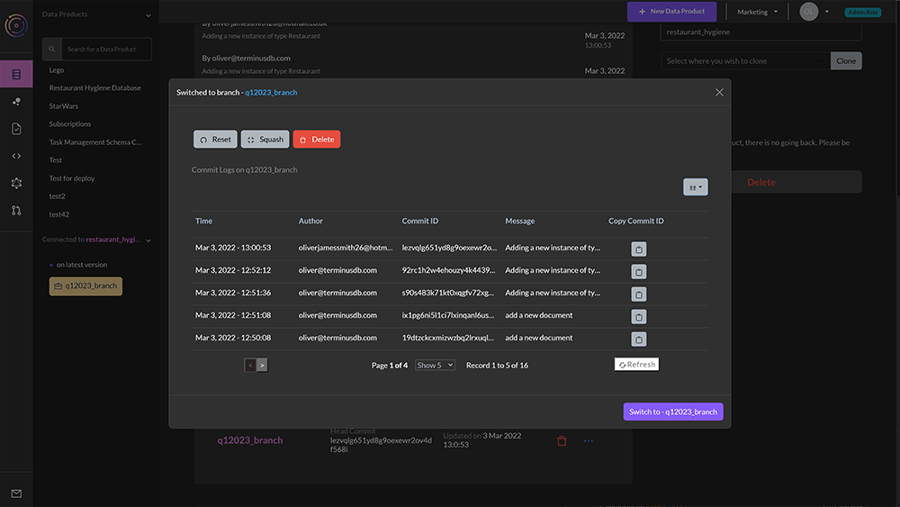
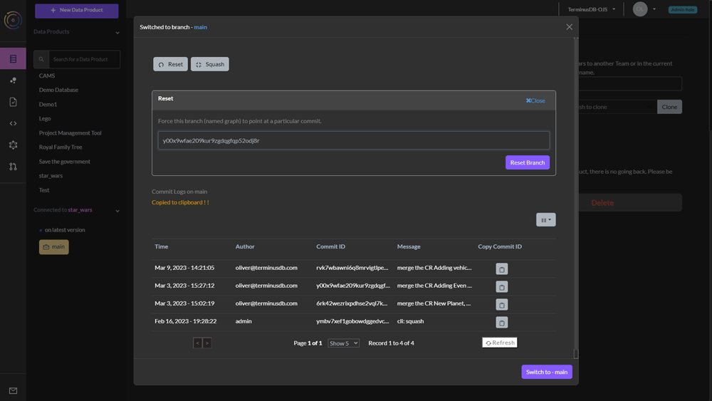

# Reset a Project

To reset a branch of a database, or indeed main, navigate to the project home page, the first icon on the left that looks like a database.

Scroll down to the `Manage Branches` section and selected `Branches`.

Next to the branch you want to reset, select the ellipses symbol to see the branch options.

<figure><figcaption></figcaption></figure>

Choose the `Reset` button.

Choose the commit you would like to reset to and copy the commit ID by selecting the clipboard icon. _You can inspect commits using the_ [_time travel feature_](time-travel.md)_._

Paste the commit ID and press the `Reset Branch` button.

<figure><figcaption></figcaption></figure>
