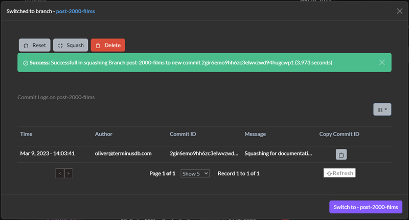

# Squash Commits

To squash a branch of a database, or indeed main, navigate to the project home page, the first icon on the left that looks like a database.

Scroll down to the `Manage Branches` section and selected `Branches`.

Next to the branch you want to squash, select the ellipses symbol to see the branch options.

<figure><figcaption></figcaption></figure>

Choose the `Squash` button.

Give the operation a description and press the `Squash Branch` button.

<figure><figcaption></figcaption></figure>


Be wary as squashing a project will result in the commit history being lost

