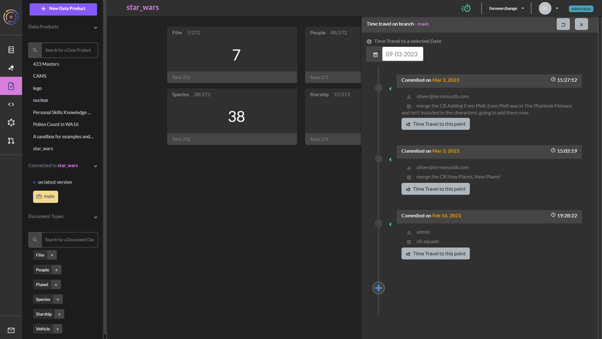
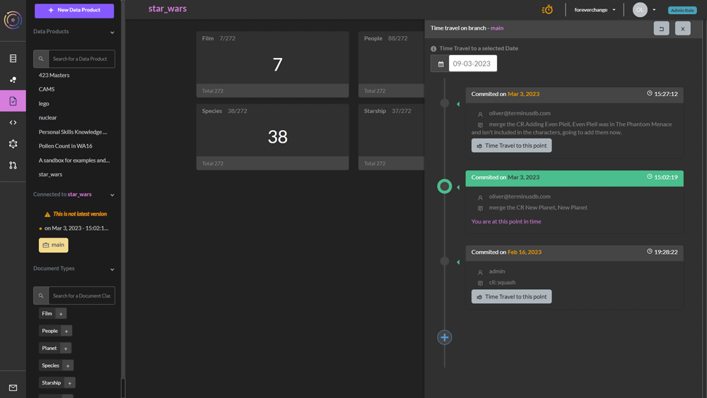

# Time Travel

It is possible in the TerminusCMS dashboard to time travel to any previous commit and examine the data and schema. This is particularly useful if you want to see what something looked like at a particular date, or if something has broken and you want to see when the last stable state was so you can revert back to it.

Time travel is each to do. From any screen when viewing a project (apart from the project home page), you will see a `stopwatch symbol` in the top bar.

Select this and a panel will appear from the right.

<figure><figcaption></figcaption></figure>

Each commit in the list features the comments from the merged change request.

Travel back in time by selecting the button next to the commit you want to go back to.

<figure><figcaption></figcaption></figure>

The dashboard informs you that you are not on the latest version.

You can then go an inspect the data in your project and the schema to see what's changed.
