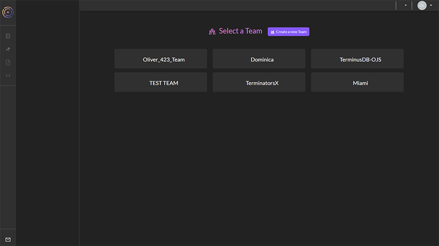
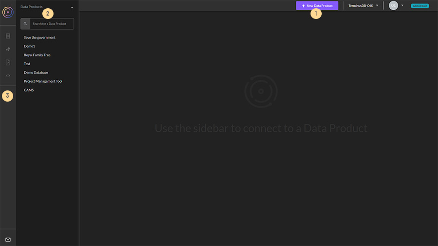

# Basic Layout

### **Basic layout**

When first logged in, you will see a list of the teams you are part of. Click on a team.

The team selection layout looks as such:

<figure><figcaption>
<strong>When you first login to the dashboard, select your team</strong>
</figcaption></figure>

When you select a team, the layout looks like this:

<figure><figcaption></figcaption></figure>

1. **Top Menu** - From left to right:&#x20;
   * Create a new data product&#x20;
   * Team - use the dropdown menu to toggle between teams&#x20;
   * User management & profile - Manage access control to teams and data products. In TerminusDB, and log in as different users.
   * Role - see your role for the team or data product.&#x20;
2. **Data Products** - A team can have one or many data products. Data products within a team are shown in this pane.&#x20;
3. **Data Product Tools** - Tools are only available when a data product is selected. From top to bottom:&#x20;
   * Data Product Home - Contains a snapshot of the data product, its recent commits, branch management, and the ability to delete the data product.&#x20;
   * Model Builder - Build schema using our visual modeling tools, or simply import schema as JSON. You can create documents, subdocuments, and enums, and establish document properties and relationships to build your document graph.&#x20;
   * Document Explorer - Once you’ve created your schema, you can explore the document frames and even add data to your database using the automatically generated forms.&#x20;
   * WOQL Query Playground - Build and test queries against your data.
   * GraphQL Query Playground - As above but with GraphQL
