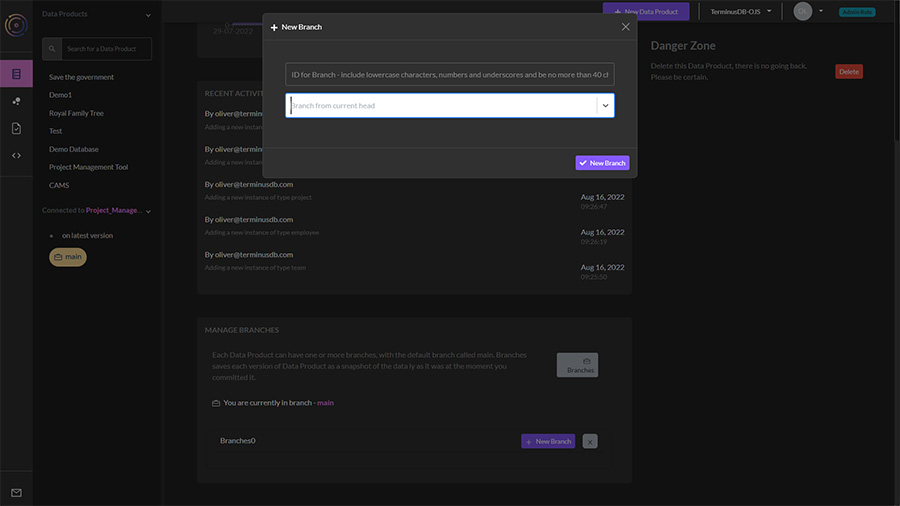
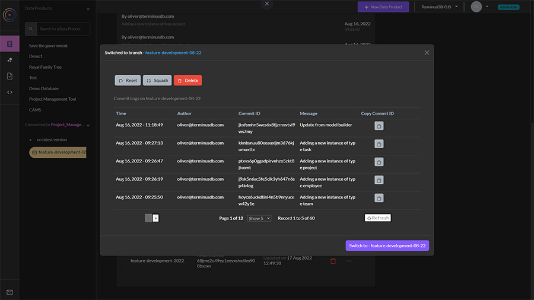

# Branch a Database

### Creating and managing branches

You can create branches of your data product within the local dashboard, to do this follow these instructions:

<figure><figcaption></figcaption></figure>

1. Choose Data Products from the lefthand menu - the first icon.&#x20;
2. Click on branches and select new branch.&#x20;
3. Name your branch and choose whether you want an empty branch, or to create it from the current head.

<figure><figcaption></figcaption></figure>

You can now switch between main and your branches by selecting the ellipsis menu where you can also reset to a specific commit, or squash the branch.
