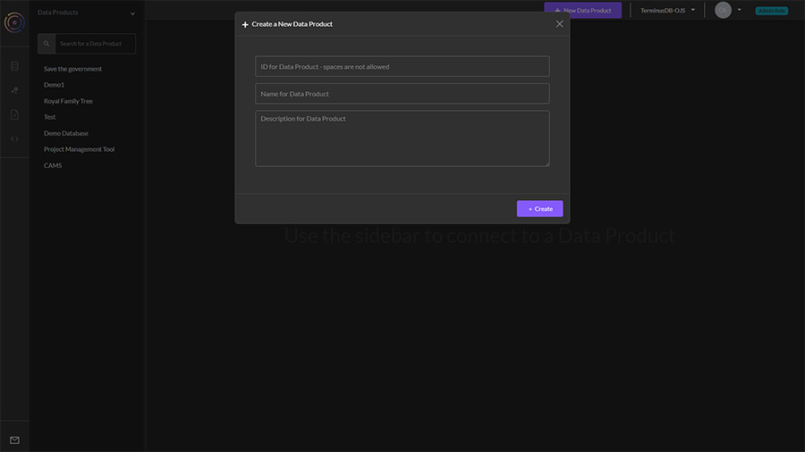

# Create a Database

### Create a new data product

Creating your first data product is easy.

1. Select ‘New Data Product’&#x20;
2. Give it an ID (only alphabetic characters and underscores are allowed)&#x20;
3. Name it something meaningful to you&#x20;
4. Give it a description so that you and other team members can see its purpose.

<figure><figcaption></figcaption></figure>
