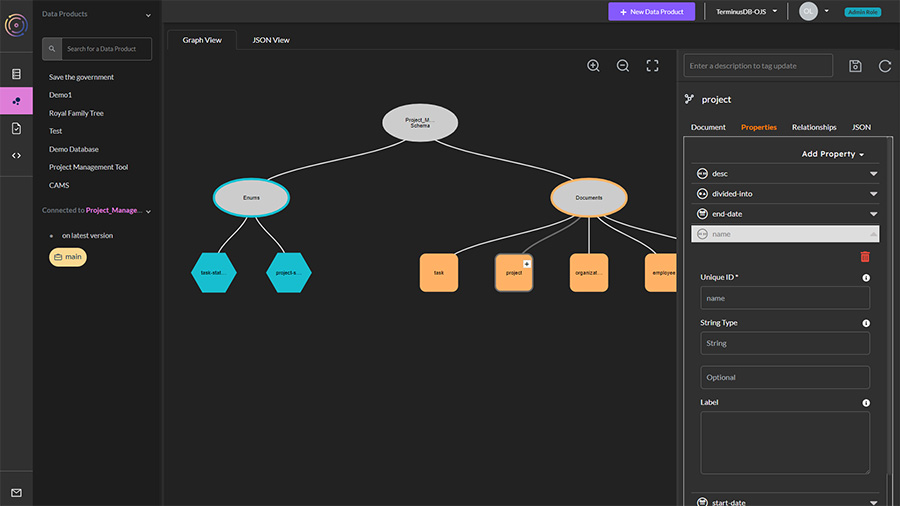
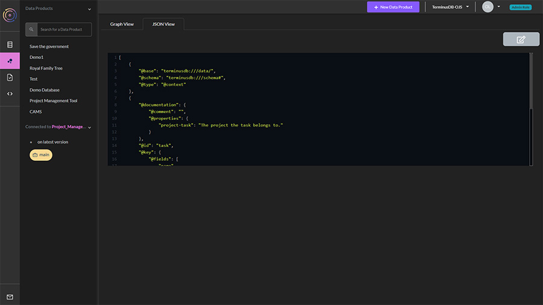
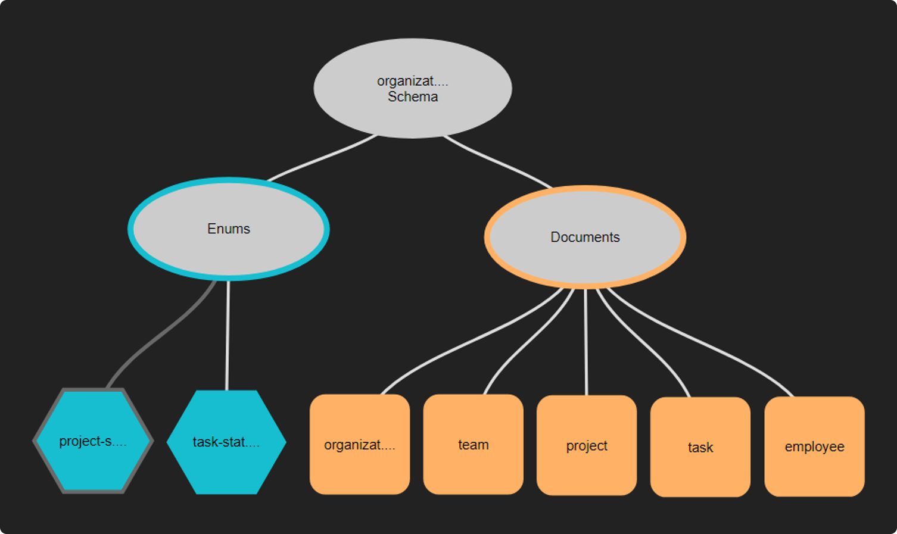
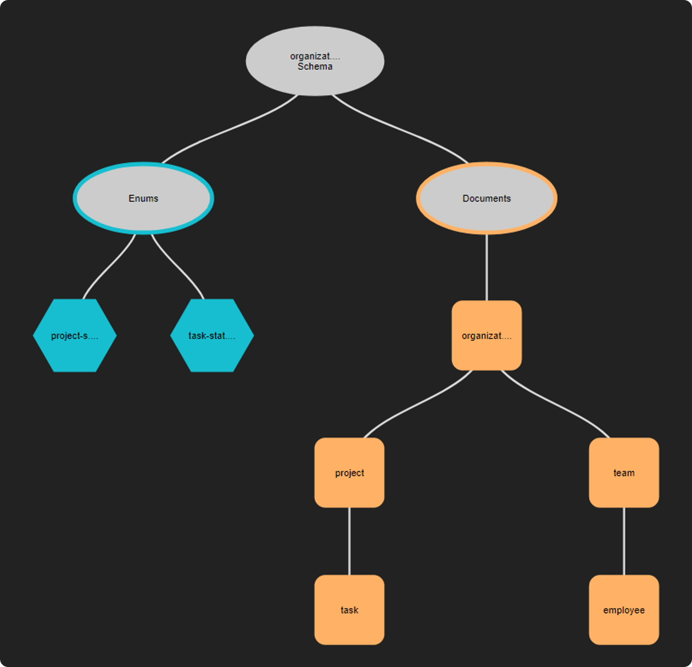

# Model Schema

### Using the UI to Build a Schema

The TerminusCMS and TerminusDB dashboard comes with a visual schema builder. Here's a quick overview of how it works.

<figure><figcaption></figcaption></figure>

1. Choose Data Product Model from the lefthand menu - the second icon.&#x20;
2. In the window, you will see an oval called your data product name schema. Click on the oval and select the + symbol.&#x20;
3. Add a document or enum.&#x20;
   * JSON documents form the nodes of the graph&#x20;
   * Enumerated types are a set of possible choices&#x20;
4. Select `add document`.&#x20;
5. On the right, you will see a set of options to define the document:&#x20;
   * Give it a unique ID (no spaces)&#x20;
   * Define the document key, choose from ([this blog will help you decide what key to use](https://terminusdb.com/blog/uri-generation/)):&#x20;
     * Lexical (need to set up document properties first)&#x20;
     * Hash (need to set up document properties first)&#x20;
     * Random&#x20;
     * ValueHash
6. Add the document properties, choose from:&#x20;
   * Enum - Need to create the enums before this option becomes available&#x20;
   * Numeric&#x20;
   * String&#x20;
   * Geo&#x20;
   * Temporal&#x20;
   * Boolean&#x20;
   * JSON&#x20;
   * Link - building the relationships in the graph&#x20;
7. On the next tab, you can see the relationships in the graph, this will show links between objects. You can also set the document as a parent/child of another document.&#x20;
8. The final tab when creating the document shows it in its JSON format.&#x20;
9. Save your document by clicking on the disk icon.

Creating subdocuments and enums can be achieved in much the same way.

### Code a Schema&#x20;

Using a visual editor to model your data isn’t everyone’s cup of tea. Should you build your schema elsewhere, importing it into the dashboard is straightforward:

<figure><figcaption></figcaption></figure>

1. Choose Data Product Model from the lefthand menu - the second icon.&#x20;
2. In the window, you will see two tabs, ‘Graph View’ and ‘JSON View’.&#x20;
3. Select JSON View.&#x20;
4. Click on the edit icon.&#x20;
5. Paste your JSON schema into the window and save.

Your schema should now display in the graph view.

### Video Overview


A short video showing how to use the dashboard to build your schema and model data


### Data Modeling Explanation

Use the **Data Product Model** view in [TerminusCMS](https://dashboard.terminusdb.com) or the local TerminusDB dashboard ([including in bootstrap install](../../../terminusdb/install/install-as-docker-container.md)) to visually build simple or complex data models. The diagrams further below illustrate two possible implementations of the organization model introduced in the previous section. In addition to visually building models, the dashboard enables:

* Flexible relationships between elements such as documents and sub-documents, and classes and sub-classes.
* Enumeration objects related to document elements.
* A comprehensive set of properties (XSD data types) for elements.
* JSON views of product models and properties.

#### A simple document model

This example uses a simple project management application that has a data structure like:


The diagram below illustrates an implementation of the organization model using a simple document structure. The enumeration objects hold status values applicable to projects and tasks.

#### Diagram: The organization model using documents



#### A class-based document model

The diagram below illustrates a more intuitive implementation of the organization model using documents and sub-documents, or classes or sub-classes. This approach enables sub-documents to inherit the properties of the parent document - similar to inheritance in Object-Oriented Programming.&#x20;

#### Diagram: The organization model using classes and sub-classes



#### Data modeling using JSON

TerminusDB supports the creation of data models using JavaScript Object Notation (JSON.) TerminusDB also generates JSON for models created visually using the dashboard.

#### Class hierarchies

JSON supports the definition of classes and subclasses. Classes define **types** of complex data structures. Sub-classes inherit all parent data type definitions. Examples below.

**Class**

```javascript
"@type": "Class",
"@id": "organization",
```

**Subclass**

```javascript
"@type": "Class",
"@id": "team",
"@inherits": "organization",
```

**Properties for team**

```javascript
"name": "xsd:string",
"desc": "xsd:string",
"cost_code": "xsd:integer",
"location": "xdd:coordinate",
"setup_dt": "xsd:dateTime"
```

**JSON for the organization model**

```javascript
[
  {
    "@base": "terminusdb:///data/",
    "@schema": "terminusdb:///schema#",
    "@type": "@context"
  },
  {
    "@id": "project-status",
    "@type": "Enum",
    "@value": [
      "in-progress",
      "on-hold",
      "completed"
    ]
  },
  {
    "@id": "project",
    "@inherits": "organization",
    "@key": {
      "@type": "Random"
    },
    "@type": "Class"
  },
  {
    "@id": "organization",
    "@key": {
      "@type": "Random"
    },
    "@type": "Class"
  },
  {
    "@id": "team",
    "@inherits": "organization",
    "@key": {
      "@type": "Random"
    },
    "@type": "Class"
  },
  {
    "@id": "task",
    "@inherits": "project",
    "@key": {
      "@type": "Random"
    },
    "@type": "Class"
  },
  {
    "@id": "task-status",
    "@type": "Enum",
    "@value": [
      "in-progress",
      "on-hold",
      "completed"
    ]
  },
  {
    "@id": "employee",
    "@inherits": "team",
    "@key": {
      "@type": "Random"
    },
    "@type": "Class"
  }
]
```

### Further Reading

#### Come from a relational database background?

[Have a read of the Relational vs Graph explanation](../../../explanations/relational-vs-graph-databases/)
