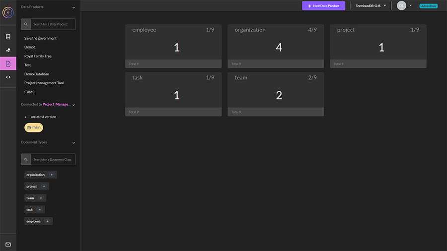
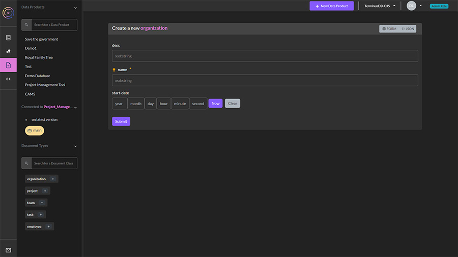

# Explore & Curate Documents

### Exploring documents&#x20;

Once you have created your schema you can explore the documents you created. TerminusDB creates document frames based on your schema and you can see what data is in the database, add data, and check out the document structure visually.

<figure><figcaption></figcaption></figure>

1. From the lefthand menu, select document explorer - third icon.&#x20;
2. The initial window shows you how many documents you have by type. You can select a type to see the individual documents, and drill down further by clicking on the resulting list, here you can:&#x20;
   * Edit the document&#x20;
   * Delete it&#x20;
   * View the JSON.&#x20;
3. To add a document, select the + symbol in the type (from the lefthand column) you want to add.&#x20;
4. The document frame will appear. This is defined by your schema.

<figure><figcaption></figcaption></figure>
