# Manage Access Control with Dashboard

This article is a beginner's guide to managing organizations/teams and users with the TerminusDB dashboard.

In this article, we’ll do the following:

* Install the local TerminusDB dashboard&#x20;
* Provide an overview of the default admin login and screens&#x20;
* Go through the administration and access control mechanisms to create new roles, users, and teams and connect them to data products.

### Install the Dashboard

[Install and run TerminusDB as a Docker container](../../../terminusdb/install/install-as-docker-container.md), also referred to as TerminusDB bootstrap.

When installed, TerminusDB creates by default, an **admin user** and **admin team**. The admin user has the privileges to manage data products, and create teams and users.&#x20;

Go to [**http://localhost:6363/dashboard**](http://localhost:6363/dashboard) **and start to build your teams, users, and data products.**

### Login to TerminusDB

Login to the TerminusDB Dashboard using your admin credentials. if you did not change it, the default admin password is root.

<figure><figcaption></figcaption></figure>


1. Fill the form with the user (admin) and your admin password &#x20;
2. Press "Login"&#x20;
3. You'll be redirected to the dashboard home page

### **Dashboard Home Page**

On the home page, you'll find a list of teams (referred to as Organizations in the TerminusDB System Database)

Select an existing team or create a new one. If no team is created or selected, some of the dashboard functionalities are disabled.

The _**Create a new Team**_ button is enabled only for the admin user.

Admin can create a new personal team where they are the admin and can also create additional Teams and Users and configure user roles using the administrator interface.

<figure>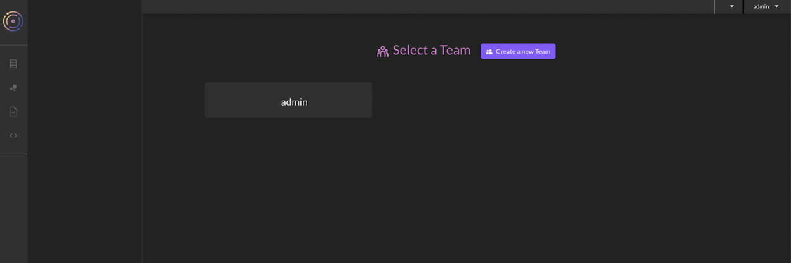<figcaption></figcaption></figure>

### **Creating a new team for the admin user**

1. Click the button _**Create a new Team**_&#x20;
2. The Create new team window will pop up&#x20;
3. Insert the team name in the input field (the team name must be unique)&#x20;
4. Click _**Create Team button**_&#x20;
5. You will be redirected to the Team home page

<figure>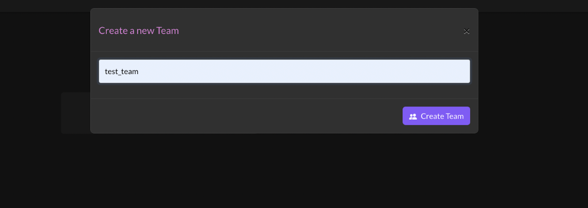<figcaption></figcaption></figure>

### **Team Home Page**

The top bar from right to left displays:

* The user role&#x20;
* The user name&#x20;
* The team name

<figure>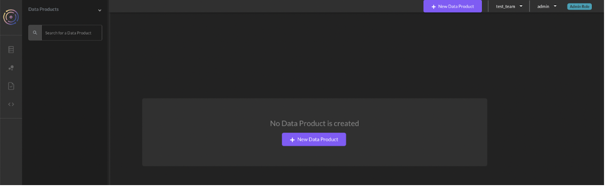<figcaption></figcaption></figure>

### **Create a New Data Product**

* Select the _**New Data Product**_ button&#x20;
* Enter the Data Product ID and name&#x20;
* Click _**Create Data Product**_ button

<figure><figcaption></figcaption></figure>

<figure>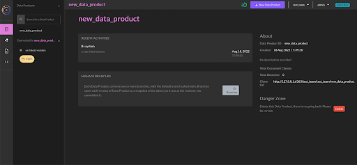<figcaption></figcaption></figure>

## **Administration and Access Control**

The administrator interface provides a visual console to easily administer TerminusDB teams and data products. In order to create roles, users, and teams, you need to be logged in as the admin.&#x20;

Access the User Management section from the top bar.

<figure>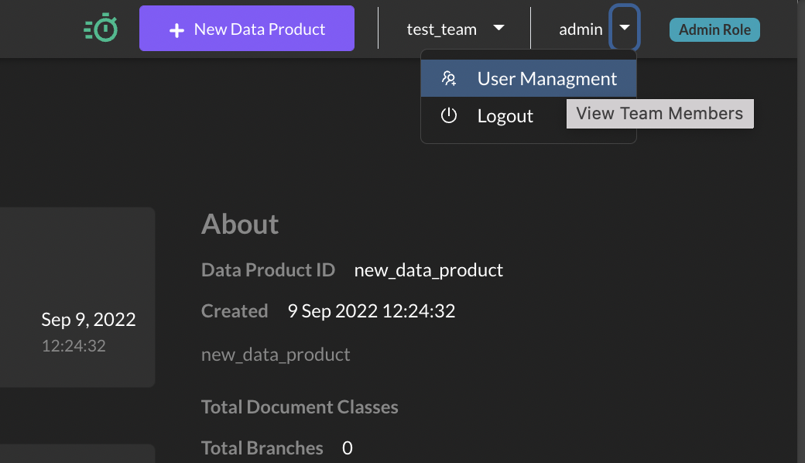<figcaption></figcaption></figure>

[Full documentation and all the definitions can be found here](https://github.com/terminusdb/terminusdb-access-control)

<figure>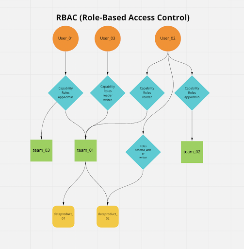<figcaption><p>This diagram illustrates the roles we'll create in this how-to guide.</p></figcaption></figure>

### Create a new Role

We are going to create four different roles: _appAdmin_, _reader_, _writer,_ and _schema\_writer_.

* Navigate to the User Management section
* Select the _**Roles**_ tab&#x20;
* Select _**Create a new Role**_ and a pop-up window will appear&#x20;
* Insert the role name and select the role permissions
* Click _**Create Role**_ button and a new role will be created

<figure>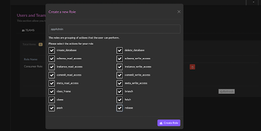<figcaption></figcaption></figure>

repeat all the steps for the others roles, you can see the actions for every roles in the image below

<figure>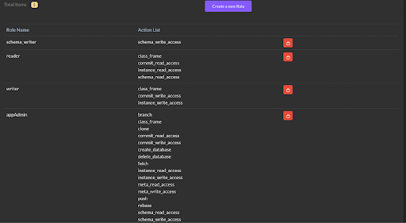<figcaption></figcaption></figure>

### Create New Users

We are going to create three new Users:&#x20;

User\_01, User\_02, and User\_03 , all with the default password "NO\_KEY"

* Select the _**Users**_ tab
* Select _**Create a new User**_ and a pop-up window will appear&#x20;
* Insert the user name and NO\_KEY as the password
* Click _**Create User**_ Button and a new User will be created

Repeat these steps for the three users.

<figure>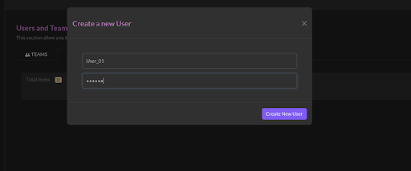<figcaption></figcaption></figure>

The new users are currently unrelated to any teams.

<figure>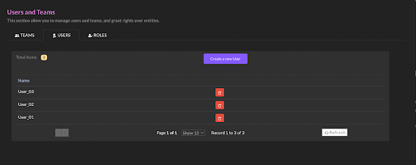<figcaption></figcaption></figure>

Next, we’ll get your teams up and running.

### Create a New Team

We are going to create three new teams: _team\_01_, _team\_02_, and _team\_03_

* Select the _**Teams**_ tab&#x20;
* Select _**Create New Team**_ and a pop-up window will appear&#x20;
* Insert the team name&#x20;
* Click the _**Create Team**_ button and a new Team will be created
* Repeat these steps for the other two teams.&#x20;

<figure>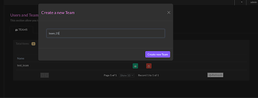<figcaption></figcaption></figure>

The new teams are not currently linked with any users.

<figure>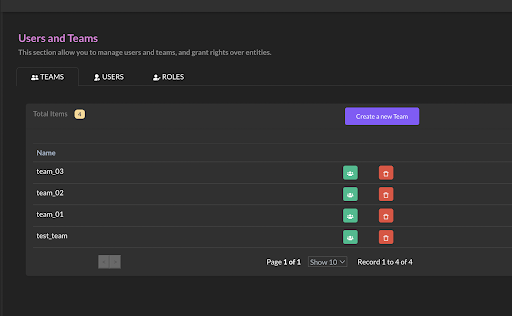<figcaption></figcaption></figure>

### Add Users to Team\_01&#x20;

We are going to add users to team\_01, assigning them roles:

* Choose the _**Teams**_ tab
* In the _**team\_01**_ row, Select the _**Show Team Users**_ icon&#x20;
* Select _**Add Users to team\_01 Team**_&#x20;
* From the drop-down list, select _**User\_01**_ and check the _**appAdmin**_ role
* Click _**Send,**_ the User_01 can now access the team team_01 and all the data product under the team with role appAdmin

<figure>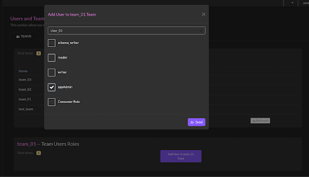<figcaption></figcaption></figure>

<figure>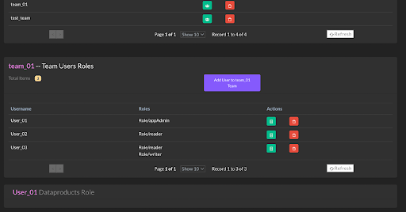<figcaption></figcaption></figure>

Repeat the same steps for the other users:&#x20;

User\_01 -> role -> reader&#x20;

User\_02 -> role -> reader /writer

Then do the following:

* Connect team\_03 with User\_01 with a role appAdmin&#x20;
* Connect team\_02 with User\_02 with a role appAdmin

### Log in with the User\_01

Now we are going to log in with User\_01:

* From the top bar, select **Logout**&#x20;
* You will redirect to the login page
* Insert the user name and password - User\_01 and NO\_KEY&#x20;
* Press the _**Login**_ button

<figure>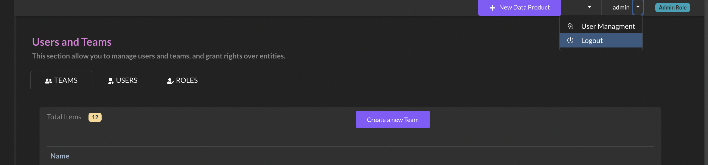<figcaption><p>Logout the admin user</p></figcaption></figure>

<figure>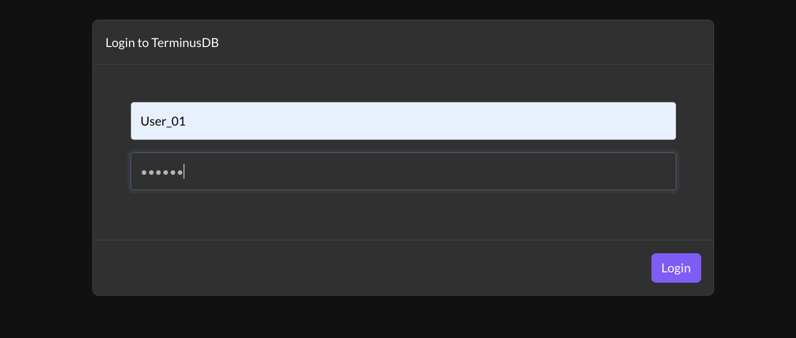<figcaption><p>Login with User_01</p></figcaption></figure>

#### User\_01 teams Homepage

When you first sign in, you will see a list of the teams associated with this user, select team\_01.

<figure>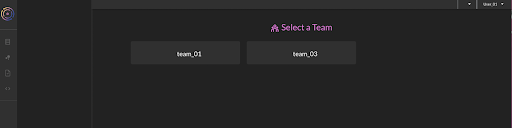<figcaption></figcaption></figure>

There are no data products associated with the team, so first we’ll create two new data products.

* Press the _**New Data Product**_ button and name it dataproduct\_01&#x20;
* Repeat the process and name this one dataproduct\_02

On the top bar, you will see from right to left:

* the user team role/s "appAdmin",&#x20;
* the user name, User\_01&#x20;
* the selected team name team\_01

<figure>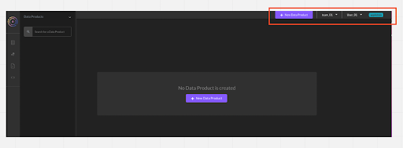<figcaption></figcaption></figure>

User\_01 has the access privileges to create new data products and manage them.

#### Create a Schema

* Select the _**Data Product Model**_ icon from the icons menu on the left
* Select _**JsonView**_ on the Data Product Model page and copy the following schema&#x20;
* Select the _**save icon**_

```json
[
    {
        "@base": "terminusdb:///data/",
        "@schema": "terminusdb:///schema#",
        "@type": "@context"
    },
    {
        "@id": "Person",
        "@key": {
            "@fields": [
                "name"
            ],
            "@type": "Lexical"
        },
        "@type": "Class",
        "name": "xsd:string"
    }
]
```

<figure>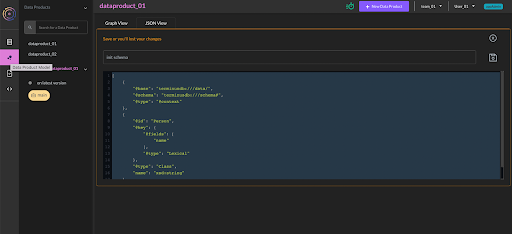<figcaption></figcaption></figure>

User\_01 has ‘appAdmin’ privileges, so if navigating around the dashboard you can see that they can perform all the actions. For example, select the "document explorer" button on the left and insert a new Person Document.

<figure>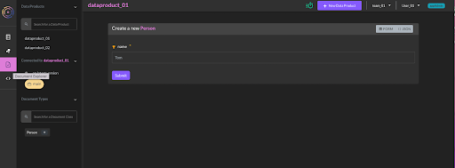<figcaption></figcaption></figure>

### Connect with User\_02

* Select **Logout**  for the upper user menu
* You'll redirect to the login page
* Insert the credentials - User\_02, password NO\_KEY
* Press _**Login**_ button
* For the teams home page select _**team\_01**_
* You'll arrive on the team\_01 main page&#x20;
* From the left menu, Select _**dataproduct\_01**_

On the top bar from right to left you can see the user role "reader", the user name User\_02, and the team name team\_01

The user does not have permission to create databases within team\_01 so the _**New Data Product**_ button is hidden.

<figure>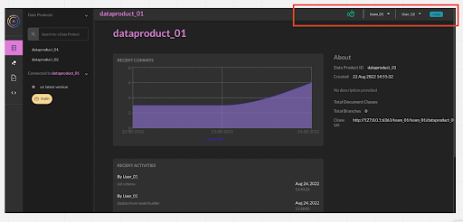<figcaption></figcaption></figure>

The user has schema\_read permission level, and from the "Data Product Model" section, they can see the schema graph in view mode.

<figure>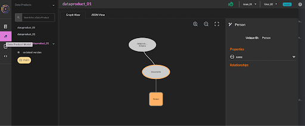<figcaption></figcaption></figure>

### Data product level permissions.

Login with the admin user again (the admin user is the only one that can manage teams, user roles, and capabilities)

* Select **Logout** from the top menu bar,&#x20;
* You'll redirect to the login page
* Insert admin and your admin password (default is root)&#x20;
* Select **User Management** from the top user menu to navigate to the access control management interface&#x20;
* From the team list table, select the green icon in the team\_01 row

<figure>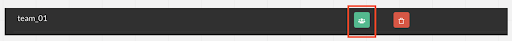<figcaption></figcaption></figure>

* From the "team\_01 -- Team Users Roles" table list, select the green icon in the User\_02 row

<figure>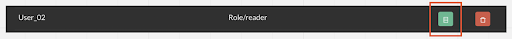<figcaption></figcaption></figure>

The user has no specific permissions at the data product level, but each data product inherits the team access level, in this instance a **reader** role.

In the User\_02 Dataproducts Roles table list, in the dataproduct\_02 row:

* Select the green _**Add database user roles icon**_&#x20;
* The Add Database new\_data\_product\_02 roles window displays&#x20;
* Select _**schema\_writer**_ and _**writer**_ roles for the list&#x20;
* Click _**Send**_

<figure>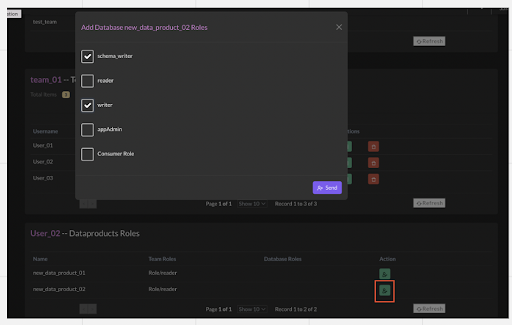<figcaption></figcaption></figure>

<figure>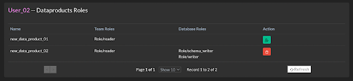<figcaption></figcaption></figure>

#### Check the new User\_02 Permission

Login with User\_02, NO\_KEY, team\_01

* On the team\_01 home page, select the _**dataproduct\_02**_ from the data products pane&#x20;
* On the top bar, from right to left you will see:&#x20;
  * User roles - reader + schema\_writer + writer&#x20;
  * The user name User\_02&#x20;
  * The selected Team team\_01

As you can see, User\_02 can now edit the schema in dataproduct\_02.

<figure>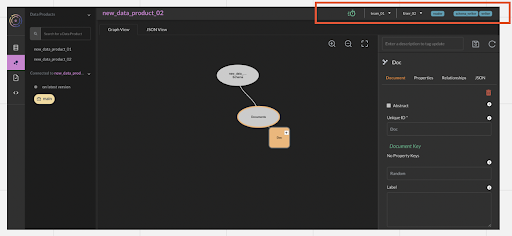<figcaption></figcaption></figure>

Now select _**dataproduct\_01**_, you will see that the user’s role is reader, so User\_02 can only view the schema for this data product.

<figure>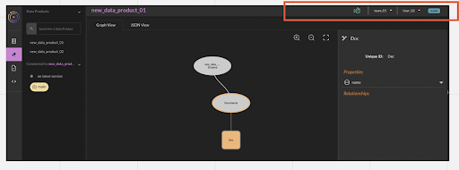<figcaption></figcaption></figure>


## Further Reading

[**Access Control Documentation**](https://terminusdb.github.io/terminusdb-access-control/#/)

[**Access Control JavaScript Reference Guide**](../../reference-guides/javascript-client-reference/accesscontrol.md)

[**Manage Access Control with the JavaScript Client**](https://terminusdb.github.io/terminusdb-access-control/#/README)
