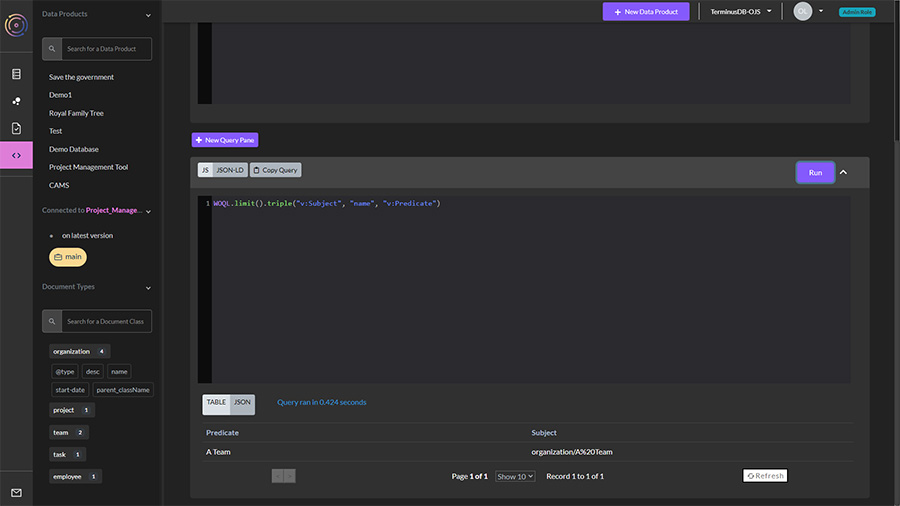
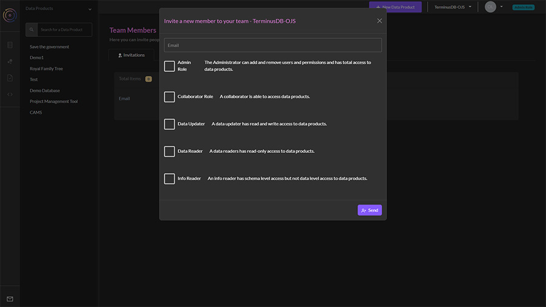
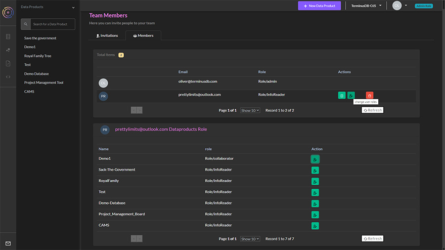
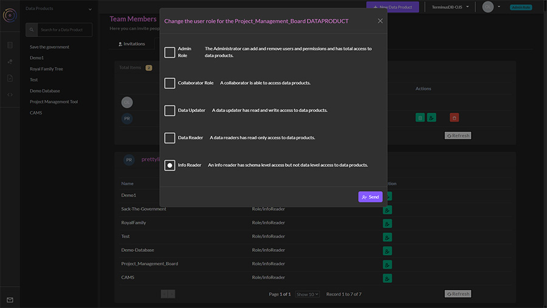

# Dashboard

The TerminusDB and TerminusX dashboard is the perfect place to model data, manage access control, and build queries. This page provides an overview of the dashboard's features.

### Install/Sign Up&#x20;

The TerminusDB local dashboard is included when you [install TerminusDB as a Docker container](../../get-started/install/install-as-docker-container.md). To use the dashboard visit:

```
http://localhost:6363/dashboard/
```

For the TerminusX dashboard, sign up for TerminusX, and when verified login to the dashboard at [https://dashboard.terminusdb.com](https://dashboard.terminusdb.com).

#### Initial teams and users&#x20;

The main difference between the TerminusX and TerminusDB dashboards is how teams and users are managed. [Visit here for guidance](../how-to-guides/manage-access-control.md) on managing access control with the local TerminusDB dashboard. TerminusX access control is [included on this page](dashboard.md#terminusx-access-control).

A team and admin user are automatically created with both dashboards.

* TerminusDB - admin user and admin team. The default values are:&#x20;
  * Team: admin
  * User: admin
  * Password: root.
* TerminusX - A team name generated from your registration credentials.

### **Basic layout**

When first logged in, you will see a list of the teams you are part of. Click on a team.

The team selection layout looks as such:

<figure><figcaption><p><strong>When you first login to the dashboard, select your team</strong></p></figcaption></figure>

When you select a team, the layout looks like:

<figure><figcaption></figcaption></figure>

1. **Top Menu** - From left to right:&#x20;
   * Create a new data product&#x20;
   * Team - use the dropdown menu to toggle between teams&#x20;
   * User management & profile - Manage access control to teams and data products. In TerminusDB, log in as different users, in TerminusX view your profile and set up your API token.&#x20;
   * Role - see your role for the team or data product.&#x20;
2. **Data Products** - A team can have one or many data products. Data products within a team are shown in this pane.&#x20;
3. **Data Product Tools** - Tools are only available when a data product is selected. From top to bottom:&#x20;
   * Data Product Home - Contains a snapshot of the data product, its recent commits, branch management, and the ability to delete the data product.&#x20;
   * Model Builder - Build schema using our visual modeling tools, or simply import schema as JSON. You can create documents, subdocuments, and enums, and establish document properties and relationships to build your document graph.&#x20;
   * Document Explorer - Once you’ve created your schema, you can explore the document frames and even add data to your database using the automatically generated forms.&#x20;
   * Query Builder - Build and test queries against your data.

### Create a new data product

Creating your first data product is easy.

1. Select ‘New Data Product’&#x20;
2. Give it an ID (only alphabetic characters and underscores are allowed)&#x20;
3. Name it something meaningful to you&#x20;
4. Give it a description so that you and other team members can see its purpose.

<figure><figcaption></figcaption></figure>

### Building your schema&#x20;

A visual data modeling tool to build schema for your data products.

#### Visual data modeling

<figure><figcaption></figcaption></figure>

1. Choose Data Product Model from the lefthand menu - the second icon.&#x20;
2. In the window, you will see an oval called your data product name schema. Click on the oval and select the + symbol.&#x20;
3. Add a document or enum.&#x20;
   * JSON documents form the nodes of the graph&#x20;
   * Enumerated types are a set of possible choices&#x20;
4. Select add document.&#x20;
5. On the right, you will see a set of options to define the document:&#x20;
   * Give it a unique ID (no spaces)&#x20;
   * Define the document key, choose from ([this blog will help you decide what key to use](https://terminusdb.com/blog/uri-generation/)):&#x20;
     * Lexical (need to set up document properties first)&#x20;
     * Hash (need to set up document properties first)&#x20;
     * Random&#x20;
     * ValueHash
6. Add the document properties, choose from:&#x20;
   * Enum - Need to create the enums before this option becomes available&#x20;
   * Numeric&#x20;
   * String&#x20;
   * Geo&#x20;
   * Temporal&#x20;
   * Boolean&#x20;
   * JSON&#x20;
   * Link - building the relationships in the graph&#x20;
7. On the next tab, you can see the relationships in the graph, this will show links between objects. You can also set the document as a parent/child of another document.&#x20;
8. The final tab when creating the document shows it in its JSON format.&#x20;
9. Save your document by clicking on the disk icon.

Creating subdocuments and enums can be achieved in much the same way.

#### Importing your schema&#x20;

Using a visual editor to model your data isn’t everyone’s cup of tea. Should you build your schema elsewhere, importing it into the dashboard is straightforward:

<figure><figcaption></figcaption></figure>

1. Choose Data Product Model from the lefthand menu - the second icon.&#x20;
2. In the window, you will see two tabs, ‘Graph View’ and ‘JSON View’.&#x20;
3. Select JSON View.&#x20;
4. Click on the edit icon.&#x20;
5. Paste your JSON schema into the window and save.

Your schema should now display in the graph view.

### Exploring documents&#x20;

Once you have created your schema you can explore the documents you created. TerminusDB creates document frames based upon your schema and you can see what data is in the database, add data, and check out the document structure visually.

<figure><figcaption></figcaption></figure>

1. From the lefthand menu, select document explorer - third icon.&#x20;
2. The initial window shows you how many documents you have by type. You can select a type to see the individual documents, and drill down further by clicking on the resulting list, here you can:&#x20;
   * Edit the document&#x20;
   * Delete it&#x20;
   * View the JSON.&#x20;
3. To add a document, select the + symbol in the type (from the lefthand column) you want to add.&#x20;
4. The document frame will appear mirroring what you set up in the schema.

<figure><figcaption></figcaption></figure>

### **Query Builder**

Use the query builder to build and test queries against your data products.

1. Select the Query Builder icon from the left&#x20;
2. In the query pane, build your query in JS WOQL or JSON-LD&#x20;
3. Hit Run to see the results.

<figure><figcaption></figcaption></figure>

You can add several query panes and use the document selector on the left to build your queries.

### Creating and managing branches

You can create branches of your data product within the TerminusX dashboard, to do this follow these instructions:

<figure><figcaption></figcaption></figure>

1. Choose Data Products from the lefthand menu - the first icon.&#x20;
2. Click on branches and select new branch.&#x20;
3. Name your branch and choose whether you want an empty branch, or to create it from the current head.

<figure><figcaption></figcaption></figure>

You can now switch between main and your branches by selecting the ellipsis menu where you can also reset to a specific commit, or squash the branch.

### **TerminusX access control**

#### Create a new team

To create a new team:

1. Click the arrow next to your profile icon in the top right corner.&#x20;
2. Select profile.&#x20;
3. From the resulting window, select ‘Create a new team’&#x20;
4. Name your team - note that no two team names can be the same.

#### Invite users to a team&#x20;

To invite team members and manage the team, do the following:

1. Click the arrow next to your profile icon in the top right corner.&#x20;
2. Select invite member.&#x20;
3. In the pop-up window, enter the user’s email address and select one of the following access permissions - _this will be applied to team-level permissions so will apply to all data products within your team. If you want to only give read-write access to a specific data product, it makes sense to give the user low-level permissions and assign higher permissions for that data product only - we will explain this next_.&#x20;
   * Admin - can add and remove users and permissions and has total access to data products.&#x20;
   * Collaborator - Able to access data products.&#x20;
   * Data Updater - Read and write access to data products.&#x20;
   * Data Reader - Read-only access to data products. Info Reader -&#x20;
   * Schema-level access but not data-level access.&#x20;
4. The user will be sent an email with a link they need to click (if they don’t receive it, tell them to check their spam folder).&#x20;
5. When the user has accepted the invitation, you will be able to see that team member within the Team Members section (you may need to refresh the page).

<figure><figcaption></figcaption></figure>

#### **Editing and removing users from the team**

To edit the role you have given a user:

1. Navigate to the Team Members section from the profile dropdown.&#x20;
2. Find the user you want to change from the list and click on the second icon.&#x20;
3. From the pop-up window, select the new role you wish to give them.

<figure><figcaption></figcaption></figure>

To delete a user from your team, do the same as above, but select the third icon in red.


Hover over the icons for information about what they do.


#### **Setting granular permissions for data products**

You may want to grant different permissions for different data products. To do this do the following:

1. Navigate to the Team Members section from the profile dropdown.&#x20;
2. Find the user you want to add specific data product permissions for and click on the first icon.&#x20;
3. The resulting table below will list all of the data products in your team.&#x20;
4. Choose the data product you want to change the user’s role for by clicking on the edit permissions icon.&#x20;
5. Choose from the list of permissions

<figure><figcaption></figcaption></figure>


You can only set permissions higher than the team permissions, so if you want to give someone read/write permissions for only one data product, ensure that you set the team permissions to a lower level.


### Further Reading

[TerminusX - Start with a Client API](../../terminusx/start-with-client.md)

[CLI Interface Guide](cli.md)

[JavaScript Client Interface Guide](javascript-client.md)

[Python Client Interface Guide](python-client.md)
