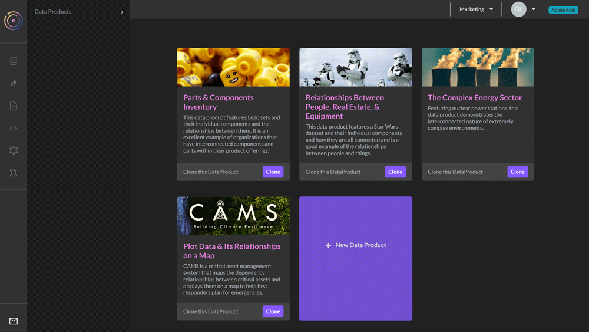

# Get Started

TerminusCMS is a headless content management system. It is designed to give devs a solution for complex content and knowledge infrastructures. Bringing together change request workflows, analytics, and complex integrations, TerminusCMS aims to be a content platform that sits at the convergence of content and knowledge.

TerminusCMS is free to get started. When you sign up, you are assigned the community package. This comes with generous limits to allow you to build for free, and then upgrade when needed.

### Steps to get started

1. Sign up at [https://dashboard.terminusdb.com](https://dashboard.terminusdb.com)
2. Take a look through the [product tour](terminuscms/product-tour/) to familiarise yourself with TerminusCMS
3. Install the [JavaScript](terminusdb/install-client/install-javascript-client.md) or [Python](terminusdb/install-client/install-python-client.md) Client
4. [Get your API key to use a client with TerminusCMS.](terminuscms/get-api-key.md)
5. [Familiarize yourself with the client API](terminuscms/start-with-client.md) to start building with TerminusCMS.

### Demo Projects

There are several [demo projects](guides/how-to-guides/use-collaboration-features/with-the-javascript-client/clone-a-project.md) available to clone and experiment with. Sign up and visit your team home page to clone these projects.

<figure><figcaption>
Your team home page features a number of demo projects to clone and experiment with.
</figcaption></figure>
