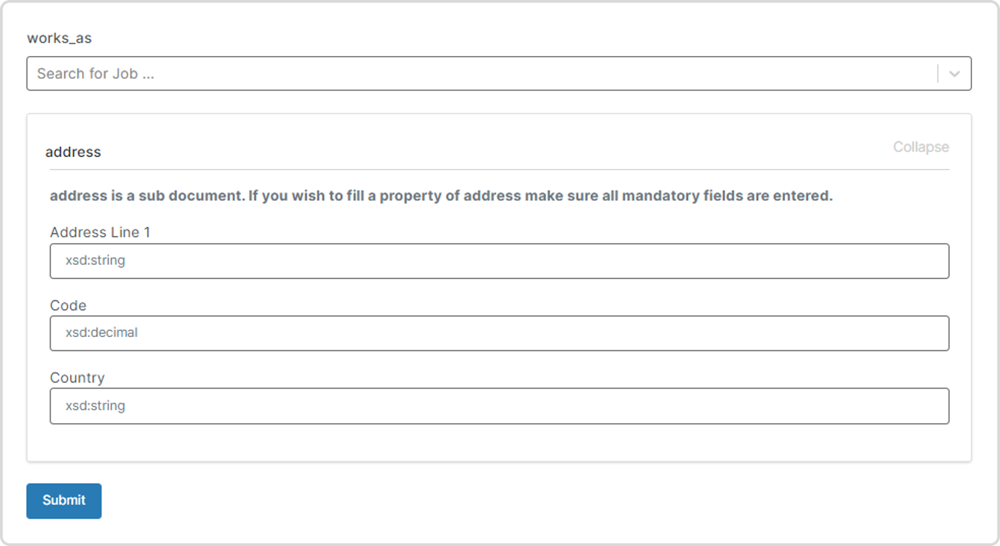
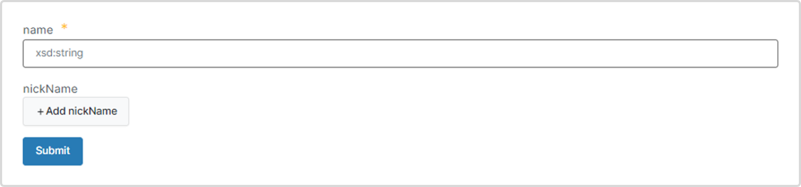
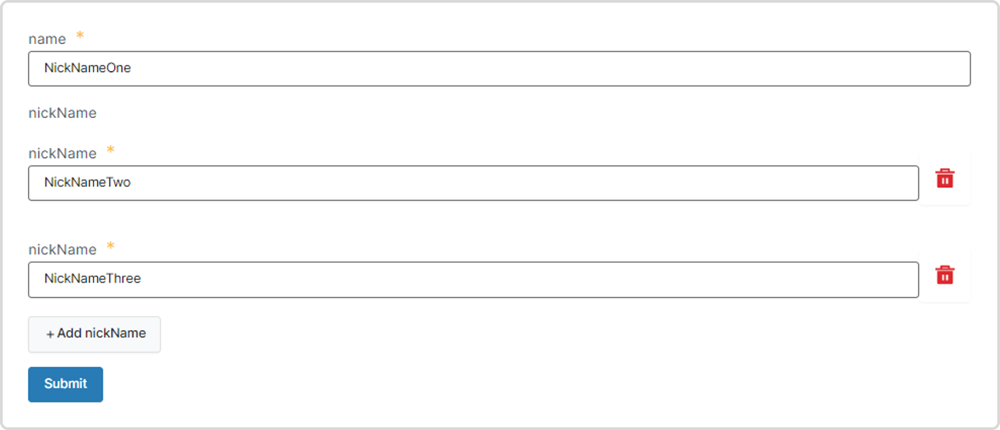
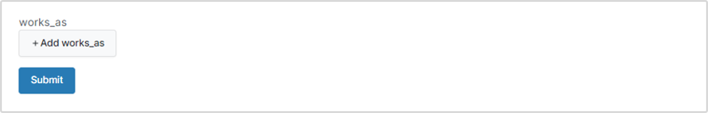
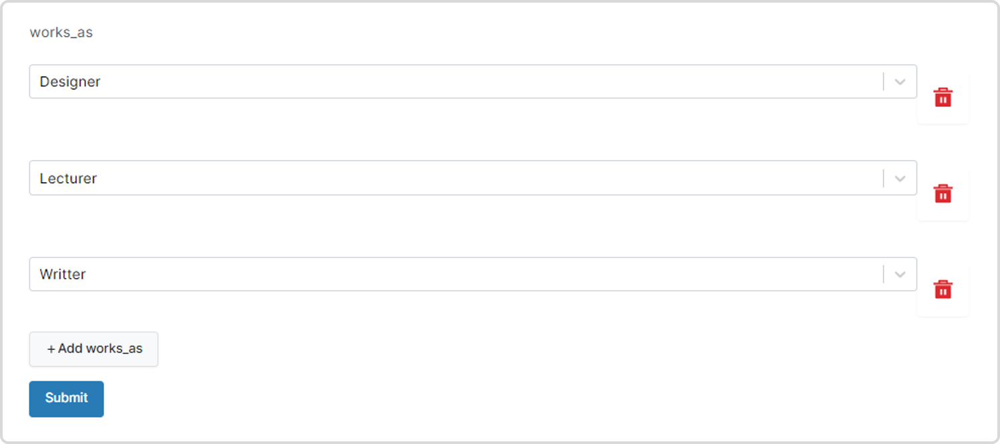
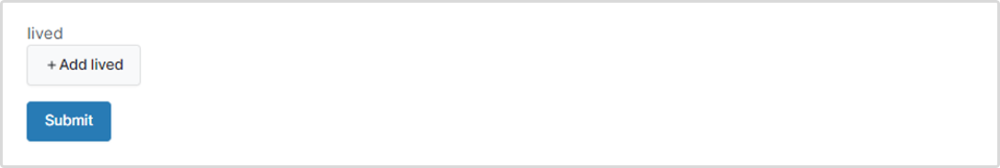
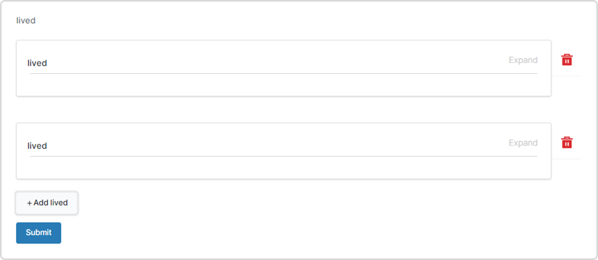
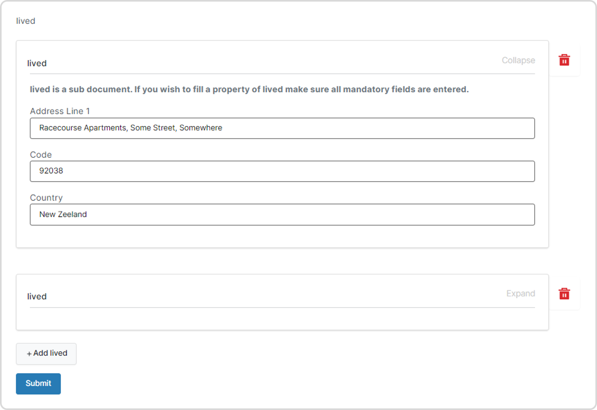
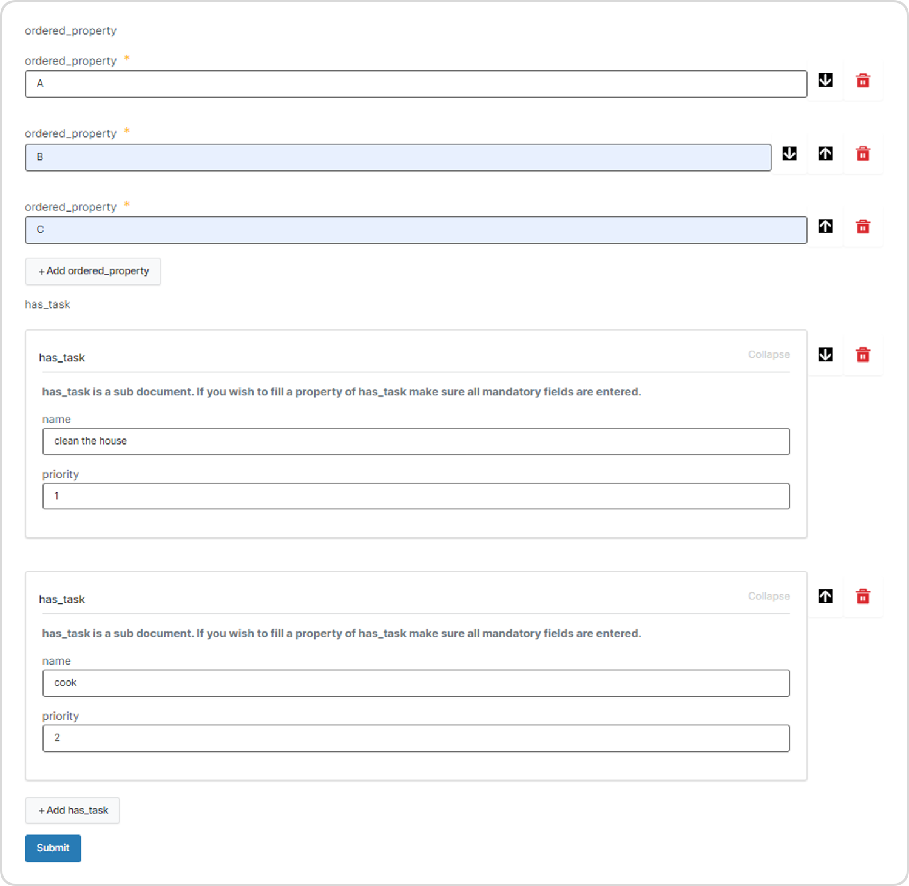
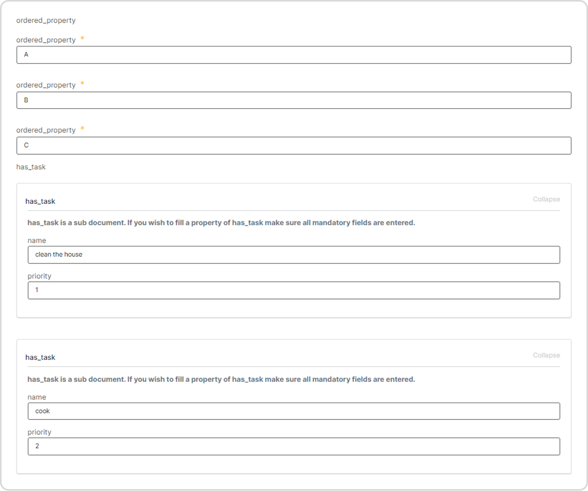

# Documents User Interface Data Types

The TerminusDB documents User Interface generates forms representing the properties or fields of document/s in your schema. For data entry, each field is one of several data types and is mandatory by default. Schema definitions enable the linking of documents and the specification of sets.

## Data types

### Basic data types

The table below lists the basic data types supported and their specifications.

| **Data type** | **Declaration**  | **Example**                                     |
| ------------- | ---------------- | ----------------------------------------------- |
| Boolean       | `"xsd:boolean"`  | `"active": "xsd:boolean"`                       |
| Decimal       | `"xsd:decimal"`  | `"age": "xsd:decimal"`                          |
| Enum          | `"@type: "Enum"` | `"@values": ["red", "blue", "yellow", "green"]` |
| Integer       | `"xsd:integer"`  | `"age": "xsd:integer"`                          |
| Decimal       | `"xsd:decimal"`  | `"age": "xsd:decimal"`                          |
| String        | `"xsd:string"`   | `"name": "xsd:string"`                          |
| Temporal      | `"xsd:dateTime"` | `"DOB": "xsd:dateTime"`                         |

### Data value optionality

Form values are mandatory by default and corresponding field names are rendered with an asterisk. To define a property as optional, use the `"@type": "Optional"` declaration.

### An example with all basic types

**Enum**

The `"Enum"` data type in the example below specifies the colors a person likes - `"@id": "Colors`, `"Person"`, `"likes"`. This is rendered as a dropdown menu with the colors specified in the `"@values"` list.

**Optional**

The `"age"` of a `"Person"` is declared `"Optional"`

```javascript
let frames =  {
    "@context": {
        "@base": "terminusdb:///data/",
        "@schema": "terminusdb:///schema#",
        "@type": "@context"
    },
    "Person": {
        "@key": {
            "@type": "Random"
        },
        "@type": "Class",
        "DOB": "xsd:dateTime",
        "active": "xsd:boolean",
        "age": {
		    "@class": "xsd:decimal",
			"@type": "Optional"
		},
        "name": "xsd:string",
        "likes": {
            "@id": "Colors",
            "@type": "Enum",
            "@values": [
                "red",
                "blue",
                "yellow",
                "green"
            ]
        }
    }
}

let type = "Person"
let mode = "Create"

return <FrameViewer
    frame = {frames}
    type = {type}
    mode = {mode}/>
```

## Link properties

Link properties enable links to other document or subdocument classes and are displayed as a `Select` components.

### Link properties example

The example below demonstrates:

* The property `work_as` linked to document class `Job`
* The property `lives_in` linked to a subdocument class `Address`

```javascript
let frames = {
   "@context": {
      "@base": "terminusdb:///data/",
      "@schema": "terminusdb:///schema#",
      "@type": "@context"
   },
   "Person": {
        "@key": {
        "@type": "Random"
        },
        "@type": "Class",
        "works_as": "Job", // Link to subdocument Job
	    "lives_in": "Address" // Link to subdocument Address
    },
    "Job": {
        "@key": {
        "@type": "Random"
        },
        "@type": "Class",
        "title": "xsd:string"
    },
    "Address": {
	    "@key": {
		    "@type": "Random"
		},
		"@subdocument": [],
		"@type": "Class",
		"Address Line 1": "xsd:string",
		"Code": "xsd:decimal",
		"Country": "xsd:string"
	}
}

let type = "Person"
let mode = "Create"

return <FrameViewer
    frame = {frames}
    type = {type}
    mode = {mode}/>
```

**Screen-print/s of the output:**



## Set properties

A set specifies an **unordered set** of values of a class or data type.

### Set property example

In the example below, the document `Person` consists of several nicknames - property `"nickName"` of `"@type": "Set"`. A set consists of zero or multiple items.

```javascript
let frames = {
    "@context": {
        "@base": "terminusdb:///data/",
        "@schema": "terminusdb:///schema#",
        "@type": "@context"
    },
    "Person": {
        "@key": {
            "@type": "Random"
        },
        "@type": "Class",
        "name": "xsd:string",
        "nickName": {
			"@class": "xsd:string",
			"@type": "Set"
	    }
    }
}

let type = "Person"
let mode = "Create"

return <FrameViewer
    frame = {frames}
    type = {type}
    mode = {mode}/>
```

**Screen-print/s of the output:**

Click  `+Add nickName` to add a **set** of `nickName` properties.



Populate multiple `nickName`fields.



### Document class set example

In the example below, a `Person` has a property `works_as` defined as a set that links to the document `Job`, representing a person with multiple jobs.

```javascript
let frames = {
    "@context": {
        "@base": "terminusdb:///data/",
        "@schema": "terminusdb:///schema#",
        "@type": "@context"
    },
    "Person": {
        "@key": {
            "@type": "Random"
        },
        "@type": "Class",
        "name": "xsd:string",
        "works_as": {
            "@class": "Job",
            "@type": "Set"
        }
   },
   "Job": {
	   "@key": {
		  "@type": "Random"
	   },
	   "@type": "Class",
	   "title": "xsd:string"
    }
}

let type = "Person"
let mode = "Create"

return <FrameViewer
    frame = {frames}
    type = {type}
    mode = {mode}/>
```

**Screen-print/s of the output:**



Populate multiple `Jobs` as shown below



### Subdocument class set example

In the example below, a `Person` has a property `lived` defined as a set that links to the subdocument `Address`, representing a person's address history.

```javascript
let frames = {
    "@context": {
        "@base": "terminusdb:///data/",
        "@schema": "terminusdb:///schema#",
        "@type": "@context"
    },
    "Person": {
        "@key": {
            "@type": "Random"
        },
        "@type": "Class",
        "name": "xsd:string",
        "lived": {
            "@class": {
                "@class": "Address",
                "@subdocument": []
            },
            "@type": "Set"
        }
    },
    "Address": {
        "@key": {
            "@type": "Random"
        },
        "@subdocument": [],
        "@type": "Class",
        "Address Line 1": "xsd:string",
        "Code": "xsd:decimal",
        "Country": "xsd:string"
	 }
}

let type = "Person"
let mode = "Create"

return <FrameViewer
    frame = {frames}
    type = {type}
    mode = {mode}/>
```

**Screen-print/s of the output:**



Click the `lived` card to expand the subdocument.



Fill in the fields for the subdocument.



## List properties

A list specifies an **ordered collection** of values of a class or data type. An ordered collection means values are displayed in the order they are entered in the form.

### List property example

In the example below, a `Person` has two properties `ordered_property` (a string data type) and `has_task` (a subdocument of type `"List"`.)

```javascript
let frames = {
    "@context": {
        "@base": "terminusdb:///data/",
        "@schema": "terminusdb:///schema#",
        "@type": "@context"
    },
    "Person": {
        "@key": {
        "@type": "Random"
        },
        "@type": "Class",
        "ordered_property": {
		    "@class": "xsd:string",
			"@type": "List"
		},
	    "has_task": {
		    "@class": "Tasks",
			"@type": "List"
		}
    },
    "Tasks": {
	    "@key": {
		    "@type": "Random"
        },
		"@subdocument": [],
		"@type": "Class",
		"Address Line 1": "xsd:string",
		"Code": "xsd:decimal",
		"Country": "xsd:string"
    }
}

let type = "Person"
let mode = "Create"

// call FrameViewer
return <FrameViewer
    frame = {frames}
    type = {type}
    mode = {mode}/>
```

**Screen-print/s of the output:**

The form contains arrows to order entered values.



In `View` mode the form is displayed in the order it was created.



## See also

### TerminusDB Data Types

[TerminusDB Data Types](documents-user-interface-data-types.md#terminusdb-data-types)
