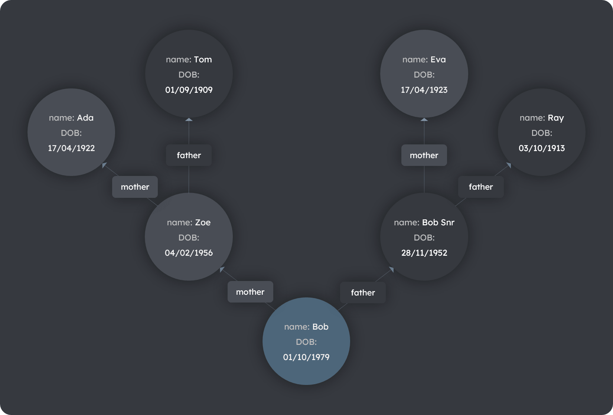
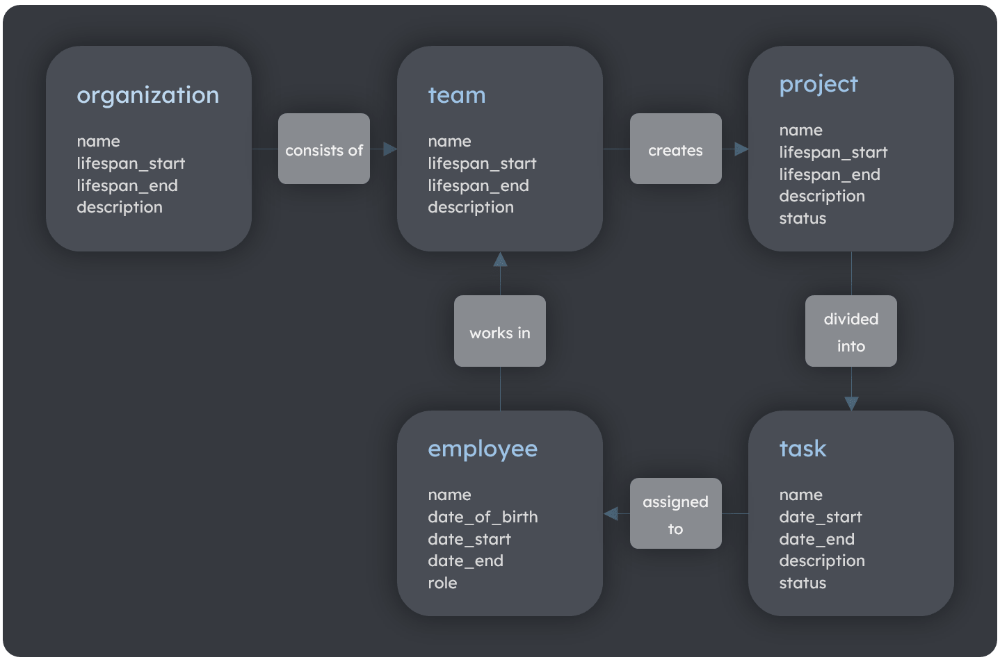

# Graph Databases

> **On this page:** An introduction to some of the core concepts behind TerminusDB graph databases.

**Key topics**

[Data modeling](to-to)

[Data query](to-do)

[Classes and properties](to-do)

## Data modeling

TerminusDB organizes data in a simple object-based structure to make it intuitive to model the real world.

Traditional relational databases divide data into tables, columns, and rows. In TerminusDB, everything is an object. Objects can have properties. Properties may link to other objects. A network of interlinked objects forms a graph structure - the foundation of graph databases.

Using objects or *things* rather than cells enables us to create databases that closely model the real world. This is because we perceive the world as consisting of things, not cells.

### Family tree example

A family tree database stores data representing individuals, their parents, and grandparents. Each type of database holds or models this data in very different ways as demonstrated by the table and diagram below. A big advantage of the graph model is that it represents real-world objects more accurately, making the model easier to understand.   

#### Table: Family tree in a relational database
| person_id | name | DOB | mother_id | father_id |
| --------- | ---- | --- | --------- | --------- |
| `1` | `Bob`     | `01/10/1979` | `2`  | `3`  |
| `2` | `Zoe`     | `04/02/1956` | `4`  | `5`  |
| `3` | `Bob Snr` | `28/11/1952` | `6`  | `7`  |
| `4` | `Ada`     | `17/04/1922` | NULL | NULL |
| `5` | `Tom`     | `01/09/1909` | NULL | NULL |
| `6` | `Eva`     | `17/04/1923` | NULL | NULL |
| `7` | `Ray`     | `03/10/1913` | NULL | NULL |

#### Diagram: Family tree in a graph database


## Data query

Querying a graph database using TerminusDB's [Web Objects Query Language](to-do) (WOQL) is also easier than using SQL. The examples below demonstrate retrieving the name of Bob's mother and grandmother. 

### Query using SQL

The relational (SQL) example below uses a two-query approach to get the name of mother, then grandmother. Note the second query uses two nested sub-queries.

### Query using WOQL

The graph (WOQL) example uses a triple pattern to get both names in one short query. There are no joins - joins are implied by using the same ID in different parts of the query. Using `v:mother_id` multiple times creates the chain: 

`v:person_id = mother => v:mother = mother => v:grandmother`

#### Code: Family tree traversal using SQL
```sql

select  name 
from    table_name 
where   person_id = 
(
        select  mother_id
        from    table_name 
        where   name = "Bob"
)

select  name 
from    table_name 
where   person_id = 
(
        select  mother_id
        from    table_name 
        where   person_id =
        (
                select  mother_id
                from    table_name 
                where   name = "Bob"

        )
)


```

#### Code: Family tree traversal using WOQL
```javascript

WOQL.and
(
   WOQL.triple("v:person",         "mother", "v:mother_id"),
   WOQL.triple("v:mother_id",      "name",   "v:mother_name"),
   WOQL.triple("v:mother_id",      "mother", "v:grandmother_id"),
   WOQL.triple("v:grandmother_id", "name",   "v:grandmother_name"),
)


```

## Classes

The TerminusDB schema enables the definition of **classes** and **subclasses**. Classes define types of complex data structures. Similar to inheritance in Object-Oriented Programming, subclasses inherit all parent type definitions. 

The schema also enables the definition of **properties**. Each property has a **domain** and a **range**. The domain is the class that is the subject of a property. The range is either a basic datatype (for example, an integer or string) or a class.           
Under the hood, TerminusDB uses a very rich data modeling language called OWL - the Web Ontology Language. Although it is a very rich language, the basic ideas are simple.

## How to model your data

The correct organization of data and the correct definition of the underlying database schema are critical to any business. TerminusDB organizes data in a simple structure, making it easy to model the real world.

### Model an organization

Using a small organization as an example, the simple steps below are applied to model and define a schema for the organization and its teams, projects, tasks, and employees. [A visual modeling approach](#a-visual-modeling-approach), shown further below, is recommended as part of identifying and documenting the core components of the schema - its **elements**, **properties**, and **relationships**.

- [Step 1. Identify the elements of the organization](#step-1-identify-the-elements-of-the-organization)

- [Step 2. Identify the properties of each element](#step-2-identify-the-properties-of-each-element)

- [Step 3. Identify the relationships between elements](#step-3-identify-the-relationships-between-elements)

#### Diagram: A visual modelling approach


#### Step 1. Identify the elements of the organization

> :information_source:&nbsp;&nbsp;&nbsp;Elements are similar to entities in relational database terminology. 

The elements relevant to this example are identified in the table below. Note that as each element is described, the relationship/s between them begin to emerge.

#### Table: Elements of an organization
| Element | Element description |
| ------- | ----------- |
| `organization` | The main organization. |
| `team`         | The teams within the `organization.` |
| `project`      | The projects that a `team` creates. |
| `task`         | The tasks of the `project`. |
| `employee`     | The employee assigned to `task`. |

#### Step 2. Identify the properties of each element

> :information_source:&nbsp;&nbsp;&nbsp;Properties are similar to attributes in relational database terminology.

A property is an item of data describing the element.

#### Table: The properties of elements
| Element | Properties |
| ------- | -------- |
| `organization` | `name`, `lifespan_start`, `lifespan_end`, `description` |
| `team`         | `name`, `lifespan_start`, `lifespan_end`, `description` |
| `project`      | `name`, `lifespan_start`, `lifespan_end`, `description`, `status` |
| `task`         | `name`, `lifespan_start`, `lifespan_end`, `description`, `status` |
| `employee`     | `name`, `date_of_birth`, `date_start`, `date_end`, `role` |

#### Step 3. Identify the relationships between elements

> :information_source:&nbsp;&nbsp;&nbsp;Relationships are the same in graph and relational database terminology. 

Relationships define the associations or interactions between elements.

#### Table: The relationship between elements
| Element | Element | Relationship (phrasal verb) | Relationship description |
| ------- | ------- | ------------ | ---- |
| `organization` | `team`     | `consists of` | An `organization` `consists of` `team`s |
| `team`         | `project`  | `creates`  | A `team` `creates` `project`s |
| `project`      | `task`     | `divided into`  | A `project` is `divided into` `task`s |
| `task`         | `employee` | `assigned to` | A `task` is `assigned to` a `employee` |  

<!-- to-do: TRANSLATE -->

In our schema, we can define classes - which are definitions of types of complex data structure. Classes can be subclasses of other classes, which means that they inherit all the parent’s definitions (much like inheritance in object-oriented programming). We can also define properties in the schema - each property has a domain (the class that is the subject of the property) and a range - the type of data that the property points to. The range can either be a simple datatype literal (e.g. an integer or string) or it can be a class.

For most use cases, that’s all you really need to know. You define a hierarchy of classes to represent the different types of things that you want to represent in your database, then you define properties to represent the different attributes of these things that you want to record and the relationships between the things. From these simple building blocks - class hierarchies and typed properties, you can build almost arbitrarily complex data structures to represent whatever real world entities you are interested in.