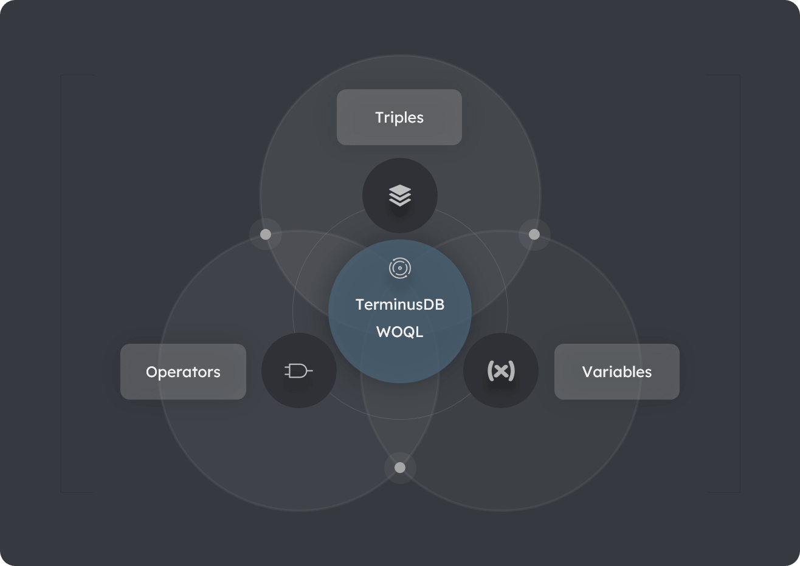

# WOQL Queries

> **On this page:** An introduction to the TerminusDB query language - the Web Objects Query Language (WOQL.)

WOQL is a powerful query language that enables you to concisely query complex data patterns and structures. WOQL is based on a small set of simple concepts making it easy to use. There are just three fundamental concepts to WOQL - [WOQL triples](#woql-triples), [WOQL variables](#woql-variables) and **WOQL operators** as illustrated in [Diagram: The three core WOQL concepts](#diagram-the-three-core-woql-concepts).

**Key topics**

[WOQL triples](#woql-triples)

[WOQL variables](#woql-variables)

[WOQL condition operators](#woql-condition-operators)

[WOQL math operators](#woql-condition-operators)

[WOQL regular expressions](#woql-condition-operators)

#### Diagram: The three core WOQL concepts



## WOQL Triples

In TerminusDB, every particle or piece of information, including objects and documents, is stored and accessed as collections of triples. All objects are broken down deterministically, or reliably, into a precise set of triples. Also, TerminusDB adheres to the **RDF** standard, ensuring triples have a standardized structure and interpretation. This means you can write queries based on the data patterns you are interested in, without requiring knowledge of low-level data structures such as tables and columns.       

### The structure of a triple

- A triple is a simple data structure with three slots expressed as: `triple-slot-1 | triple-slot-2 | triple-slot-3`.

- You can assign any meaning/definition/terminology to each slot, and insert any value into a slot.

- In TerminusDB terminology, slots are defined as: `object-id | property | value` respectively.  

#### Table: Examples of triples

| Example# | object-id | property        | value         | Interpretation | 
| -------- | --------- | --------------- | ------------- | -------------- |
| 1        | `jake`    | `date-of-birth` | `01-jan-1935` | Jake's date of birth is 01-jan-1935 |
| 2        | `jake`    | `parent`        | `mary`        | Jake's mother is Mary |
| 3        | `mary`    | `date-of-birth` | `01-jan-1900` | Jake's mother's date of birth is 01-jan-1900 | 

### Triple interpretation 

Every triple with the same `object-id` is interpreted as being related to the same object, entity, or *thing*. This is how TerminusDB holds information about all things. 

### Triple relationships

As shown in Example# 2 above, the `value` slot can hold another `object-id`. This is how data relationships are defined in TerminusDB.   

### Triple inserts

Triples are added to a TerminusDB database using the `add_triple` method.

#### Code: WOQL add_triple method

```javascript

// triple-slot-1: object-id | triple-slot-2: value | triple-slot-3: property

WOQL.add_triple('jake', 'date-of-birth', '01-jan-1935')
    .add_triple('jake', 'parent',        'mary')
    .add_triple('mary', `date-of-birth`, `01-jan-1930`)


```

## WOQL variables

WOQL stores query results in variables. WOQL variables are declared as strings with the prefix `v:`, for example - `v:person-id`, `v:family-name` and `v:date-of-birth`. 

<!-- #### rewrite this ### 
If we use a variable in a triple query, TerminusDB will show us every possible value that exists in the database that could fill that variable in that position in the query.

When using a variable in a triple query, TerminusDB will retrieve all data that match the variable's value and position in the triple query.

-->

### WOQL variables in triples

As per the variable triple patterns listed below, a triple may consist of one, two, or three WOQL variables. When using a variable in a triple query, TerminusDB will retrieve all data, into that variable, that are relevant to the variable's position in the triple. 

- A **single variable triple pattern** consists of one WOQL variable in any one triple slot.

- A **two-variable triple pattern** consists of two variables in any two slots.   

- A **three-variable triple pattern** consists of variables in all three slots.

### Single variable triple pattern 

Examples of a single WOQL variable in a triple slot. 

#### Code: WOQL var in triple slot 1.

<p class="tdh-sh">Description:</p>

Select every `object-id` into `v:person-id` where `property` `date-of-birth` has the `value` `01-jan-1935`

<p class="tdh-sh">Interpretation:</p>

Select every person born on 01-jan-1935

```javascript

// triple-slot-1: object-id | triple-slot-2: value | triple-slot-3: property

WOQL.triple('v:person-id', 'date-of-birth', '01-jan-1935')


```

#### Code: WOQL var in triple slot 2.

<p class="tdh-sh">Description:</p> 

Select every `property` into `v:property-list` where `object-id` `jake` has the `value` `10`

<p class="tdh-sh">Interpretation:</p>

Select all of Jake's properties with the value 10.

```javascript

// triple-slot-1: object-id | triple-slot-2: value | triple-slot-3: property

WOQL.triple('jake', 'v:property-list', '10')


```

#### Code: WOQL var in triple slot 3.

<p class="tdh-sh">Description:</p>

Select every `value` into `v:jakes-parent` where `object-id` `jake` has the `value` `parent`

<p class="tdh-sh">Interpretation:</p>

Select Jake's parents.

```javascript

// triple-slot-1: object-id | triple-slot-2: value | triple-slot-3: property

WOQL.triple('jake', 'parent', "v:jakes-parent")


```

### Two-variable triple pattern

Examples of two WOQL variables in all combinations are listed below.

- Slots 1 and 2 

- Slots 1 and 3 

- Slots 2 and 3

#### Code: WOQL vars in triple slots 1 and 2.

Select every `object-id` and `value` into variables `v:object-id` and `v:value` respectively with `property` `10`

```javascript

// triple-slot-1: object-id | triple-slot-2: value | triple-slot-3: property

WOQL.triple('v:object-id', 'v:value', 10)


```

#### Code: WOQL vars in triple slots 1 and 3.

Select every `object-id` and `property` into varibles `v:object-id` and `v:date-of-birth` respectively with `value` `date-born`

```javascript

// triple-slot-1: object-id | triple-slot-2: value | triple-slot-3: property

WOQL.triple('v:object-id', 'date-born', 'v:date-of-birth')


```

#### Code: WOQL vars in triple slots 2 and 3.

Select every `value` and `property` into varibles `v:joe-properties` and `v:property-values` respectively with `object-id` `joe`

```javascript

// triple-slot-1: object-id | triple-slot-2: value | triple-slot-3: property 

WOQL.triple('joe', 'v:joe-properties', "v:property-values")


```

### Three-variable triple pattern

Select every triple.

#### Code: WOQL star method

```javascript

// triple-slot-1: object-id | triple-slot-2: value | triple-slot-3: property 

WOQL.star()


```

## WOQL condition operators

Query expressions using single triple pattern matching only are simple but sometimes restrictive. Therefore, WOQL provides logical operators enabling you to combine multiple patterns into sophisticated queries with simple syntax. The following basic operators are provided.

- `WOQL.and()`

- `WOQL.or()`

- `WOQL.not()`


### WOQL and operator

The `WOQL.and()` operator has identical behavior to the `and` condition in procedural programming.   

### WOQL or operator

Single triple pattern matching like the above is 


certainly neat, but there’s a limited number of things that can be expressed as a single pattern of triples, even with all our variables turned on. However, WOQL also provides logical operators, AND, OR which allow you to combine as many basic patterns as you like into incredibly expressive queries in very simple forms.

The most useful operator is logical AND - WOQL.and() which behaves as we would logically expect - if all of the patterns defined within a WOQL.and() can be filled by the database, all of the results will be returned, otherwise, no results will be returned.

The other basic logical operators: OR - WOQL.or() and NOT - WOQL.not() are also very useful - they are interpreted also as expected - in the first case, the query will return the first result that it matches in a list of possibilities, in the second case, the query will only return true if the pattern specified is not found in the database.

Below are some simple examples of using these logical operators in practice. It is amazing how many things you can readily express simply by combining these patterns in different ways. Extreme simplicity and absolute regularity in the little things allow extreme elegance of description in the big things.

## WOQL math operators

<!-- to-do: times or multiply? -->

WOQL provides several math operators for data going into and coming out of a database. The [Python Client](to-do) documentation has the full list of math operators. Some of the operators provided include `plus`, `multiply`, `times`, `divide`, `exp`, and `div` (for integer division.) 

### Using WOQL math operators

To use a WOQL math operator, encapsulated it in `WOQL.eval` show in the examples below. You can use variables for holding values used in all math operators.

#### Code: WOQL plus math operator  

Bind the value of `1` `plus` `2` to the variable `x`. The variable `x` is reusable in later queries.

```javascript

let [ x ] = vars('x')

WOQL.eval(plus(1, 2), x)

// Result x = 3


```

#### Code: WOQL times and div math operators

Bind the value of `3` `times` `2` to the variable `product` `and` bind the value of `product` divided by (`div`) `2` to the variable `result`.

```javascript

let [product, result] = vars('product', 'result')
and
(
    WOQL.eval(times(3, 2), product),
    WOQL.eval(div(product, 2), result)
)

/** Results
  
    | product | result |
    | ------- | ------ |
    | 6       | 3      |
*/

```

## WOQL in JSON-LD format

WOQL queries are converted to the JSON-LD document format for transmission over the network. You can access the JSON-LD format for a query in JavaScript or Python as follows. Refer to the [WOQL JSON-LD Reference](../md/reference-woql-json-ld) for a full list of WOQL JSON-LD classes.

<br>

<!-- tabs:start -->

### **JavaScript**

<i class="tdb-i"></i>Use the JavaScript `query` object.

```javascript

let jsonld = query.json()


```

### **Python**

<i class="tdb-i"></i>Use the Python `WOQLQuery().dict()` class.

```python

jsonld = WOQLQuery().dict()


```

<!-- tabs:end -->

## See Also

### WOQL regular expressions

How to [use regular expressions](how-to/how-to-use-regex) with WOQL.

### WOQL update data

How to [update data](how-to/how-to-update-data) using WOQL triples.