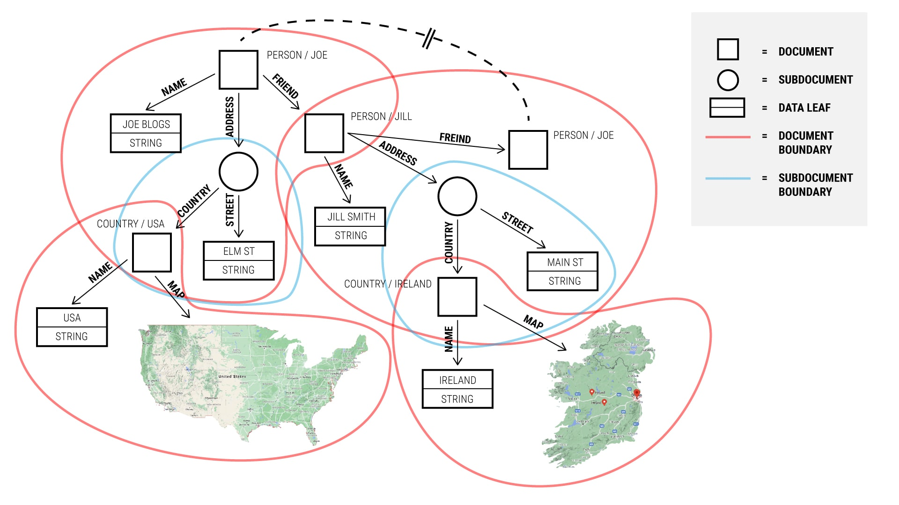

# Documents

> **On this page:** The types of documents available in TerminusDB with examples of their definitions and interactions.

## Key topics

[The TerminusDB document store](#the-terminusdb-document-store)

[Simple documents](#simple-documents)

[Documents with references](#documents-with-references)

[Subdocuments](#sub-documents)

## The TerminusDB document store

TerminusDB is a document store as well as a knowledge graph database. TerminusDB [schemata](reference/reference-schema.md) describe how to interpret segments of graphs as self-contained documents.   

### TerminusDB storage structure

The underlying storage structure of TerminusDB is a **labeled**, **directed**, and **edge-labeled** graph. Each source and target node has a distinct name, and every edge has a name and a direction.

### Graph segments as documents

Segments of the graph are **documents**. Documents can be extracted as JSON objects, providing a convenient data package for applications. JSON objects can be updated by submitting modified versions. The graph's entire document segment can be deleted by deleting the document. However, the full graph structure is retained, allowing sophisticated search and traversal.

### Subdocuments overview

Documents can contain **subdocuments**. A subdocument:

- Is owned by its containing document. 

- Is a segment of the graph which is solely pointed to by the containing document. 

- Can have any number of outgoing links to other documents or subdocuments.

See the [Subdocuments](#subdocuments) section for more information.

## Simple documents

Documents are described by creating a class definition in the [schema](reference/reference-schema.md). The simplest document definition contains properties with data elements only. 

### A simple document example

The [Football roster CSV file](#data-football-roster-csv-file) is loaded using the [Football roster class definition](#code-football-roster-class-definition) below. This class definition describes the JSON document that can be submitted or retrieved from the graph.

A valid [Football roster JSON document definition](#code-football-roster-json-document-definition), which corresponds to a row in the CSV file, is also shown below. 

#### Data: Football roster CSV file

```csv
name,   position
George, Centre Back
Doug,   Full Back
Karen,  Centre Forward
```

#### Code: Football roster class definition

```json
{ "@type"   : "@context",
  "@schema" : "terminusdb://Roster/document/",
  "@base"   : "terminusdb://Roster/schema#" }

{ "@type"   : "Class",
  "@id"     : "Player",
  "name"    : "xsd:string",
  "position": "xsd:string" }
```

#### Code: Football roster JSON document definition

```json
{ "@type"   : "Player",
  "@id"     : "Player/George",
  "@base"   : "terminusdb://Roster/schema#",
  "name"    : "George",
  "position": "Centre Back" }
```

### The JSON document definition

The following table describes the properties of the JSON document definition above.

#### Table: Properties of the JSON document definition

| Property | Value | Description |
| -------- | ----- | ---------- |
| `@type`  | `Player` | The type of data held - a football player |   
| `@id`    | `Player/George` | The address of the document used for retrieval, update, or deletion, or as a reference used in other documents. If the address in `@id` is unambiguous, for example, when used in the same collection, then `@id` can be used as-is, i.e., as `Player/George`. Otherwise, the `@base` property is required. |
| `@base`  | `terminusdb://Roster/schema#` | The **fully qualified** address for `Player/George` expanding to `terminusdb://Roster/document/Player/George`. |

### Unique document @id 

It is important to ensure a unique document `@id`. The parameters `@key` and `@base` are available in the class definition, enabling you to use a calculated `@id`. Refer to the [Schema reference](reference/reference-schema.md) for more information.

## Documents with references

TerminusDB enables references to other documents, forming a **graph of documents**. 

### Create objects from data

The [simple document example](#a-simple-document-example) introduced above is convertible to an object that refers to each player, as demonstrated in the code-snippet [Player and roster classes](#code-player-and-roster-classes). In this snippet, the `Roster` class points to a `Set` of `Player`s (or `Player` classes.)
 
#### The Set property

The `Set` property in the code-snippet is a *type family* allowing us to state that the `player` property can have any number of `Player`s attached. `Set` does not provide ordering or multiplicity; a `Player` is either connected or not connected. For ordering and multiplicity, use `@type` `List` or `Array`.

#### Code: Player and roster classes

```json
{ "@type"    : "@context",
  "@schema"  : "terminusdb://Roster/document/",
  "@base"    : "terminusdb://Roster/schema#" }

{ "@type"    : "Class",
  "@id"      : "Player",
  "name"     : "xsd:string",
  "position" : "xsd:string" }

{ 
  "@type"    : "Class",
  "@id"      : "Roster",
  "player"   : 
  { 
     "@type" : "Set",
     "@class": "Player" 
  } 
}
```

### Create documents from class specifications

A set of documents that meets the above specification and that represents the data in the [Football roster CSV file](#data-football-roster-csv-file) can be defined as:

#### Code: CSV roster data in document form

```json
{ "@type"   : "Roster",
  "@id"     : "Roster/Wolves",
  "player"  : [ "Player/George", "Player/Karen", "Player/Doug" ] }

{ "@type"   : "Player",
  "@id"     : "Player/George",
  "name"    : "George",
  "position": "Centre Back" }

{ "@type"   : "Player",
  "@id"     : "Player/Doug",
  "name"    : "Doug",
  "position": "Full Back" }

{ "@type"   : "Player",
  "@id"     : "Player/Karen",
  "name"    : "Karen",
  "position": "Centre Forward" }
```

The `Roster` points to the various `Player` documents. When requesting the document `Roster/Wolves`, each player in the `player` array is retrieved. Each identifier can be queried in a similar way to retrieve all associated documents.

## Subdocuments

A subdocument can only be pointed to by its containing document. It is information internal to the identity of a document and not intended to be shared. This designation enables deeply nested JSON documents that are self-contained and retrievable using the TerminusDB [document interface](reference/reference-document-interface). 

### A subdocument example

In the subdocument example below, the schema specification defines players with a subdocument of `stats`. `Stats` is declared a subdocument using the `@subdocument` property and the special value `[]`. Also, it has a `Random` key, meaning the key is automatically generated if not provided.

#### Code: An example of a player stats subdocument

```json
{ "@type"       : "@context",
  "@schema"     : "terminusdb://Game/document/",
  "@base"       : "terminusdb://Game/schema#" }

{ "@type"       : "Class",
  "@id"         : "Stats",
  "@subdocument": [],
  "@key"        : { "@type" : "Random"},
  "strength"    : "xsd:integer",
  "intelligence": "xsd:integer",
  "dexterity"   : "xsd:integer",
  "charisma"    : "xsd:integer",
  "wisdom"      : "xsd:integer",
  "constitution": "xsd:integer" }

{ "@type"       : "Class",
  "@id"         : "Player",
  "name"        : "xsd:string",
  "stats"       : "Stats" }
```

In the example below, the subdocument enables sending and retrieving `Stats` with the `Player` object. It is also possible for subdocuments to point recursively to other subdocuments or documents.

#### Code: Stats with the player object

```json
{ 
  "@type"         : "Player",
  "@id"           : "Player/Hieronymous",
  "stats"         : 
  { 
    "@type"       : "Stats",
    "strength"    : 14,
    "intelligence": 10,
    "dexterity"   : 14,
    "charisma"    : 8,
    "wisdom"      : 12,
    "constitution": 9 
  } 
}
```

## Visualizing the Graph

Documents and subdocuments, and references to other documents, provide the best of both worlds: document storage and knowledge graphs. However, visualizing what this means requires a bit of experience.

### A graph visualization example

The following Contact graph diagram illustrates the boundaries around what constitutes a document and a subdocument. 

An example schema representing this scenario is provided in the code-snippet [Contact graph schema](#code-contact-graph-schema) further below with an example of a corresponding [Contact graph document](#code-contact-graph-document) definition.

With a bit of practice, designing your knowledge graphs in TerminusDB will become second nature.

#### Diagram: Contact graph

<!--  -->

 
#### Code: Contact graph schema

```json
{ "@type"       : "@context",
  "@schema"     : "terminusdb://People/document/",
  "@base"       : "terminusdb://People/schema#" }

{ "@type"       : "Class",
  "@id"         : "Coordinate",
  "@subdocument": [],
  "@key"        : { "@type" : "Random"},
  "lat"         : "xsd:decimal",
  "long"        : "xsd:decimal" }

{ "@type"       : "Class",
  "@id"         : "Map",
  "coordinates" : { "@type" : "Array",
                    "@class": "Coordinate" } }

{ "@type"       : "Class",
  "@id"         : "Country",
  "name"        : "xsd:string",
  "map"         : "Map" }

{ "@type"       : "Class",
  "@id"         : "Address",
  "@subdocument": [],
  "@key"        : { "@type" : "Random"},
  "country"     : "Country",
  "street"      : "xsd:string" }

{ "@type"       : "Class",
  "@id"         : "Person",
  "name"        : "xsd:string",
  "address"     : "Address",
  "friend"      : "Person" }
```

#### Code: Contact graph document

```json
{ "@type"      : "Person",
  "@id"        : "Person/Joe",
  "name"       : "Joe Bloggs",
  "address"    : { "@type"  : "Address",
                   "@id"    : "Adress/aa1264e404a5b34381abc37cad83fabd",
                   "street" : "Elm St.",
                   "country": "Country/USA" },
  "friend"     : [ "Person/Jill" ] }

{ "@type"      : "Person",
  "@id"        : "Person/Jill",
  "name"       : "Jill Smith",
  "address"    : { "@type"  : "Address",
                   "@id"    : "Adress/5fba7438dc2b23258d304bb8cd1222bd",
                   "street" : "Main St.",
                   "country": "Country/Ireland" },
  "friend"     : [ "Person/Joe" ] }

{ "@type"      : "Country",
  "@id"        : "Country/USA",
  "name"       : "USA",
  "coordinates": [ ... ] }

{ "@type"      : "Country",
  "@id"        : "Country/Ireland",
  "name"       : "Ireland",
  "coordinates": [ ... ] }
```