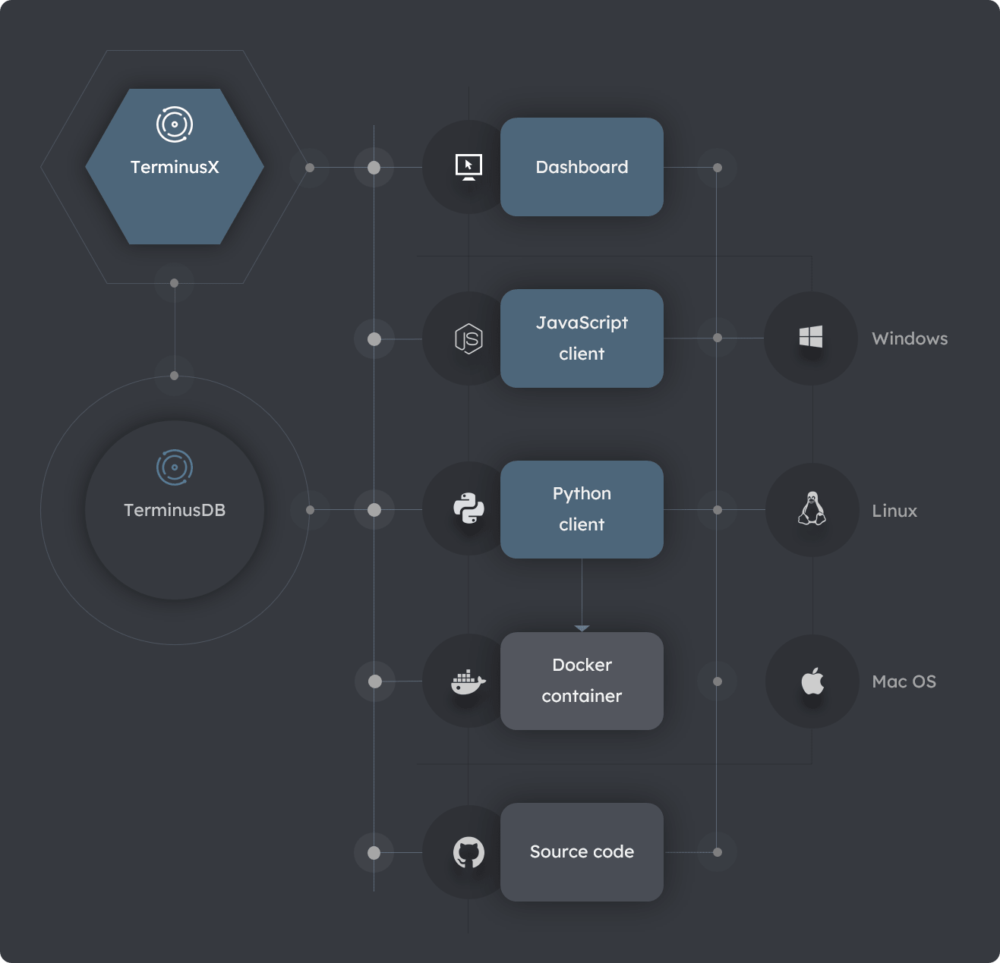
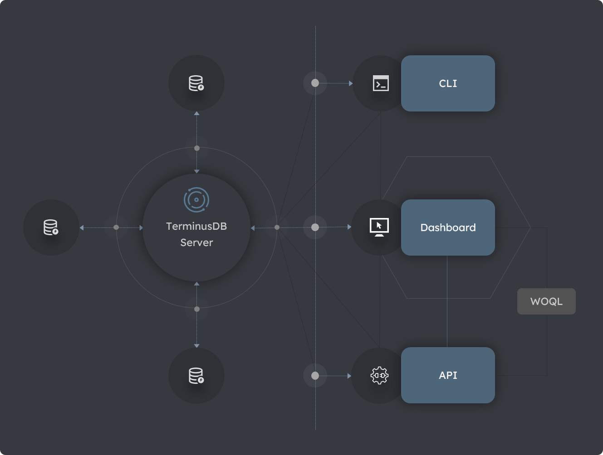

# Get Started

> **On this page:** An overview of the ways to get started with TerminusDB. 

## Key topics

[Starting overview](#overview)

[Installation overview](#installation-overview)

[Interfaces overview](#interfaces-overview)

## Starting overview

Get started in minutes on Windows, Apple, or Linux with the steps below.

### Install

Install a TerminusDB server.

### Run

Start a TerminusDB server.

### Go 

Create, query, and maintain your databases using several [programmatic interfaces](#interfaces-overview).

## Installation overview

Interaction with TerminusDB databases is through the TerminusBD Server. The server provides a **RESTful** API using the **JSON-LD** exchange format. This enables you to develop applications with your toolchain to utilize the powerful features of graph search and storage. 

To install a TerminusDB server and use TerminusDB databases programmatically in your applications, the installation options below are available. Click on an option for detailed install instructions.

### Source code

Install from the [source code](install/install-from-source-code) in [GitHub](https://github.com/terminusdb/terminusdb).

### Docker container

Install as a [Docker container](install/install-as-docker-container) also referred to as the **TerminusDB bootstrap**.

### Javascript client

Install as a [Node.js](https://nodejs.org/en/download/)-based [JavaScript client](install/install-javascript-client).

### Python client

Install as a [Python client](install/install-python-client). Also requires a [Docker container](install/install-as-docker-container) installation.

#### Diagram: TerminusDB and TerminusX install options

## Interfaces overview

TerminusDB provides several interfaces for creating, querying, and maintaining your databases. Depending on the component/s you choose to install, you can interact with TerminusDB using one or more of the available interfaces listed below.

Use one or a combination of several TerminusDB interfaces.

### Command Line Interface

The TerminusDB [Command Line Interface](reference/reference-cli) (CLI.)   

### Dashboard

The TerminusX [dashboard](terminusx/get-started) providing a visual interaface. 
 
### APIs 

The TerminusDB [Javascript client](install/install-javascript-client) and [Python client](install/install-python-client) APIs. 

### Query

The TerminusDB [Web Objects Query Language](explanation/explanation-woql) (WOQL.)    

#### Diagram: TerminusDB interfaces 

## See also

### An introduction to TerminusDB

New to TerminusDB? Find out more in an [Introduction to TerminusDB](overviews/introduction). 

### An introduction to TerminusX

New to TerminusX? Find out more in an [Introduction to TerminusX](terminusx/introduction).

### Documents

[Documents](explanation/explanation-documents) in a knowledge graph and how to use them.