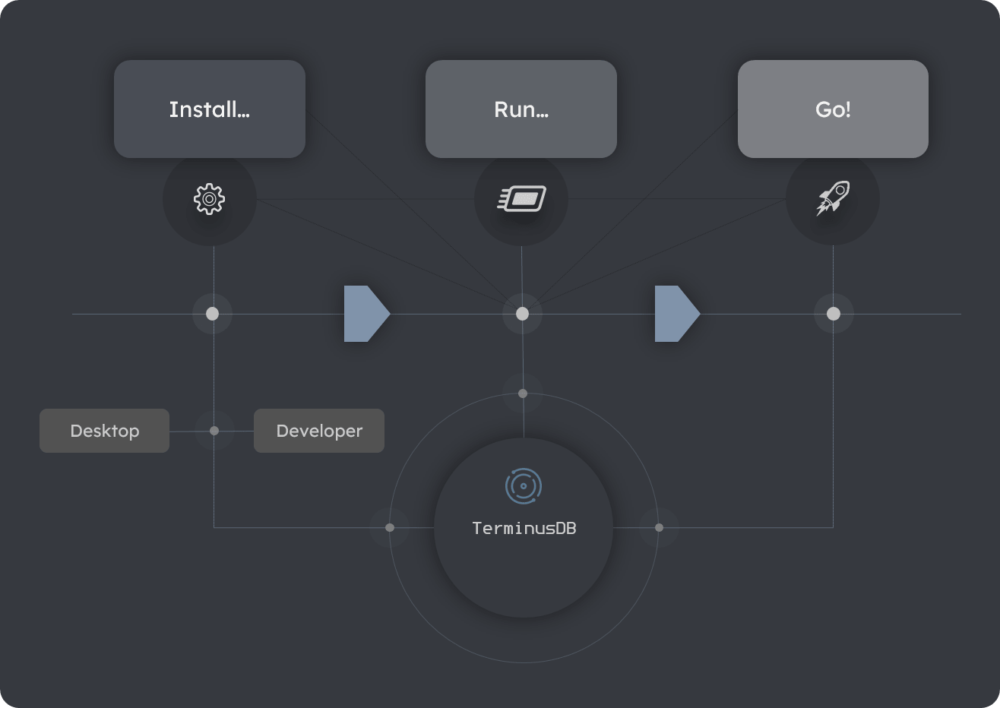
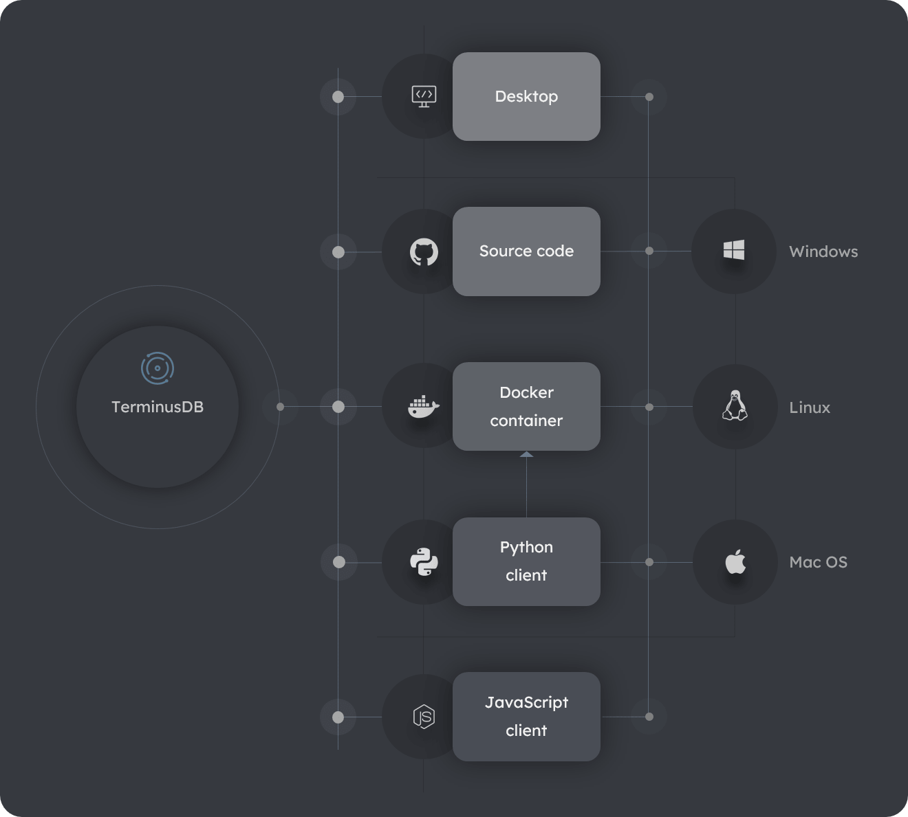

# Get started

> **On this page:** An overview of the ways to get started with TerminusDB. 

## Key topics

[Starting overview](#overview)

[Installation overview](#installation-overview)

[Interfaces overview](#interfaces-overview)

## Starting overview

Get started in minutes on Windows, Apple, or Linux with the few steps below. [Contact us](to-do) at any time for help.

### Step 1. Access or install

Install the TerminusDB console or explore several developer installation options.

### Step 2. Explore or run

Start exploring the console or start a TerminusDB server.

### Step 3. Go 

Create, query, and maintain your databases using the console and/or several [programmatic interfaces](#interfaces-overview). 

#### Diagram: Main steps to get started

## Installation overview

Install TerminusDB as a [desktop application](#desktop-installation) or explore several [developer installation options](#developer-installation-options) for programmatic access to your databases.

### Desktop installation

The TerminusDB desktop application provides an intuitive Graphical User Interface (GUI) for visually modeling, querying, and maintaining databases. Refer to [Desktop install](install-desktop) to get started.       

### Developer installation options

To install a TerminusDB server and use TerminusDB databases programmatically in your applications, the installation options below are available. Click on an option for detailed install instructions.

#### Source code

Install from the [source code](install-source-code) in [GitHub](https://github.com/terminusdb/terminusdb).

#### Docker container

Install as a [Docker container](install-docker) also referred to as the TerminusDB bootstrap.

#### Javascript client

Install as a [Node4j](to-do)-based [JavaScript client](install-javascript).

#### Python client

Install as a [Python client](install-python). Also requires a [Docker container](install-docker) installation.

#### Diagram: TerminusDB install options

## Interfaces overview

TerminusDB provides several interfaces for creating, querying, and maintaining your databases. Depending on the component/s you choose to install, you can interact with TerminusDB using one or more of the [available interfaces](#available-interfaces) listed below.

### The TerminusDB server

Interaction with TerminusDB databases is through the TerminusBD Server. The server provides a [RESTful](to-do) API using the [JSON-LD](to-do) exchange format. This enables you to develop applications with your toolchain to utilize the powerful features of graph search and storage. 

### The available interfaces

Use one or a combination of several TerminusDB interfaces.

#### Command Line Interface

The TerminusDB [Command Line Interface](quick-start-with-the-cli) (CLI.)   

#### Console

The TerminusDB console [console](quick-start-with-the-console) providing a visual interaface. 
 
#### APIs 

The TerminusDB [Javascript client](quick-start-with-javascript) and [Python client](quick-start-with-python) APIs. 

#### Query

The TerminusDB [Web Objects Query Language](data-modeling-data-modeling-woql-queries) (WOQL) for use across all interfaces.    

#### Diagram: TerminusDB interfaces 

<!-- to-do: REFACTOR
For development and testing, we recommend our [TerminusDB Bootstrap](https://github.com/terminusdb/terminusdb-bootstrap) installer, which uses the Docker image
-->