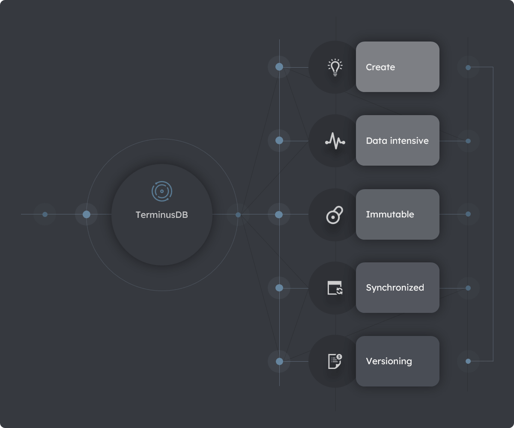
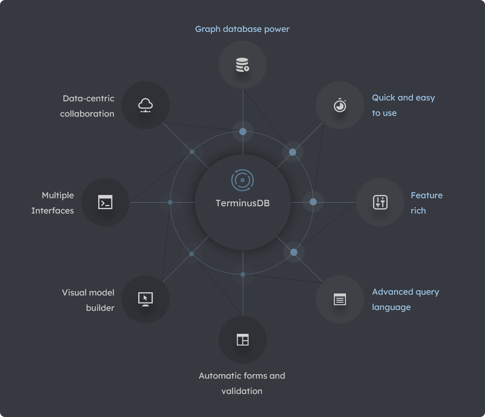
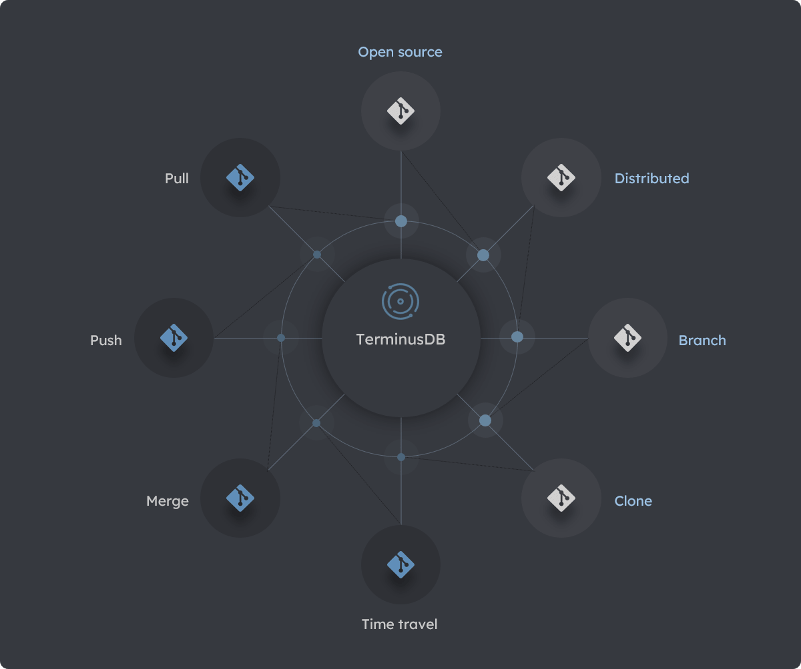

# Introduction to TerminusDB

> **On this page:** A high-level description of what TerminusDB is, reasons for using TerminusDB, and its Git-like features.

## Key topics

[What is TerminusDB?](#what-is-terminusdb)

[Why choose TerminusDB?](#why-choose-terminusdb)

[The TerminusDB Git-like model](#the-terminusdb-git-like-model)
 
## What is TerminusDB?

TerminusDB is a powerful, in-memory graph database enabling you to maximize your productivity and the value of your data. TerminusDB has numerous features and several interfaces enabling you to create data-intensive, immutable, and synchronized databases with built-in version control and other [Git-like](#the-terminusdb-git-like-model) operations.

<!-- to-do: UPDATE Data intensive in diagram to data-intensive -->

#### Diagram: Some key features of TerminusDB

## Why choose TerminusDB?

A few of the many reasons to choose TerminusDB as your graph database solution:  

### An enterprise-level graph database

Enterprise-level availability, functionality, performance, scalability, and stability. TerminusDB is a data-intensive, in-memory, high-speed and scalable platform suitable for both small and enterprise-level applications. 
 
### Quick and easy to use

Maximize your productivity and start realizing the value of your data by having your databases up and running in a few minutes. Easily create, query, and maintain your databases using graphical and programmatic interfaces.    

### Feature-rich and Git-like

Numerous unique features and [Git-like](#the-terminusDB-git-like-model) operations including clone, branch, merge, control and time-travel. TerminusDB databases are immutable, fully preserving data lineage and change history with built-in revision control, similar to distributed version control systems. 

### Advanced query language

A powerful query language enabling fast and recursive searches across complex data patterns.

### Forms and data validation

Generate forms for viewing and entering data with automatic data validation.

### Visual model builder 

Use a lightweight Graphical User Interface to easily build, maintain and enforce complex data models.

### Multiple interfaces 

Create and maintain your databases using programmatic interfaces such as JavaScript and Python APIs.

### Data-centric collaboration

TerminusDB is highly configurable with powerful features for rapidly and collaboratively creating synchronized, application-centric and data-centric databases. Maximize productivity through application and data-centric distributed development and collaboration. 

#### Diagram: Reasons to choose TerminusDB

## The TerminusDB Git-like model

TerminusDB has many Git-like features including revision-control and distributed collaboration. Similar to Git, TerminusDB is open source, model-driven, and uses the **Resource Description Framework** ([RDF](resources/glossary#RDF)) specification for collaboration.

### Delta-encoding

TerminusDB implements an advanced Git-like model, using [delta encoding](resources/glossary?id=delta-encoding) to store append or delta-only changes to graphs. These deltas are stored in succinct [terminusdb-store](https://github.com/terminusdb/terminusdb-store) data structures. The delta encoding approach enables branch, merge, push, pull, clone, time-travel, and other Git-like operations.  

#### Diagram: TerminusDB Git-like operations

## See also

### TerminusDB whitepaper

Read our [white paper](https://github.com/terminusdb/terminusdb-whitepaper/blob/418005f410cb45227e8eced7204a0d1ef8857431/terminusdb.pdf) on succinct data structures and delta encoding in modern databases.

### Get started

[Get Started](overviews/get-started) with an overview of the available [Installation Options](overviews/get-started#installation-overview) and an overview of the [TerminusDB Interafces](overviews/get-started#interfaces-overview) and their interconnections.

### TerminusX

An [Introduction to TerminusX](terminusx/introduction) the cloud infrastructure underpinning TerminusDB.

### Documents

[Documents](explanation/explanation-documents) in a knowledge graph and how to use them.