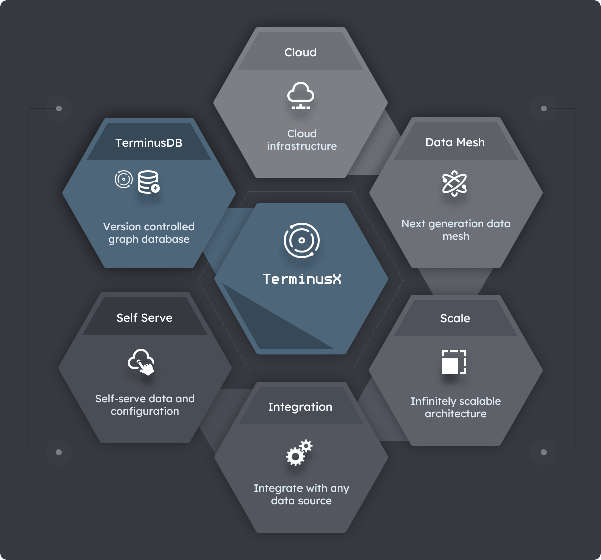

# Introduction to TerminusX

> **On this page:** A high-level description of what TerminusX is and reasons for using it.

## Key topics

[What is TerminusX?](#what-is-terminusx)

[Why choose TerminusX?](#why-choose-terminusx)

## What is TermninusX?

TerminusX is a cloud self-service data platform built on [TerminusDB](overviews/introduction). Use it to collaborate with colleagues to quickly build a vibrant ecosystem of domain data products. TerminusX is in **public beta** and you can [signup now](https://dashboard.terminusdb.com/).

TerminusDB provides a [document API](reference/reference-document-interface) for building via the JSON exchange format. The convenience of documents with the power of a knowledge graph.

#### Diagram: Some key features of TerminusX

## Why choose TerminusX?

A few of the many reasons to choose TerminusX as your data product and graph database solution:  

### Build decentralized data products

Build, source, and share decentralized, versioned data products irrespective of volume or throughput. 
 
### Empower domain teams

Maximize the efficiency, productivity, and skills of your domain teams. Empower them to build, source, and consume data products across boundaries and domains.  

### Faster Time to Market

Empower domain teams to deliver results and products rapidly through collaboration and version.

### Reduced data discovery time 

Unprecedented data transparency enabling you to rapidly discover the value of your data. You have complete visibility and audit of data changes across your entire data ecosystem.

### Greater data quality and innovation

A robust, quality data foundation providing better predictions, insights, and answers, while enabling you to safely experiment with data and schema.

### Increased data stability

Enterprise-level stability and reliability, essential for business and mission-critical services.

### Build data products organically 

TerminusX stores data as documents in a JSON-like format - the most natural way to visualize data.

## See also

### TerminusX whitepaper

Read our [white paper](https://landing.terminusdb.com/terminusx-whitepaper).

### Get started

[Get started](terminusx/get-started) now and be up and running in minutes.

### TerminusDB

Find out more about [TerminusDB](overviews/introduction).