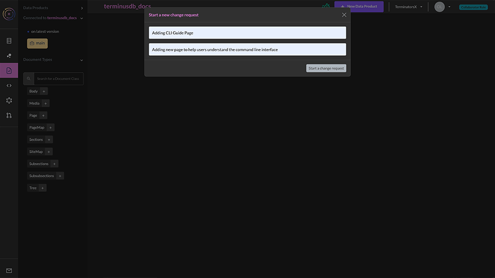
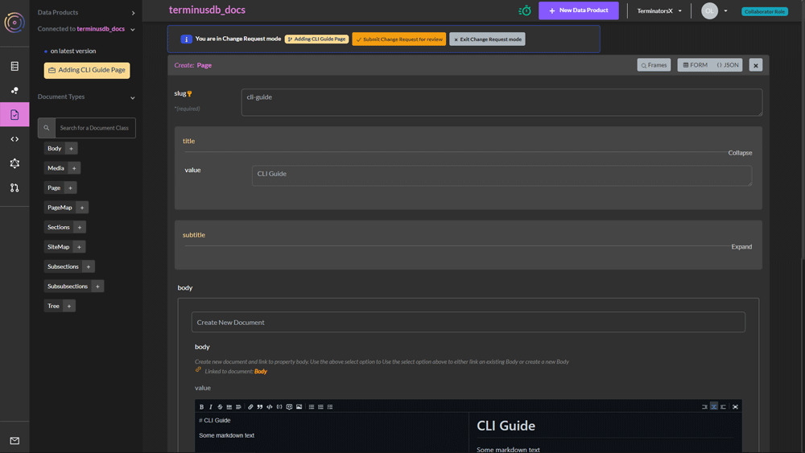
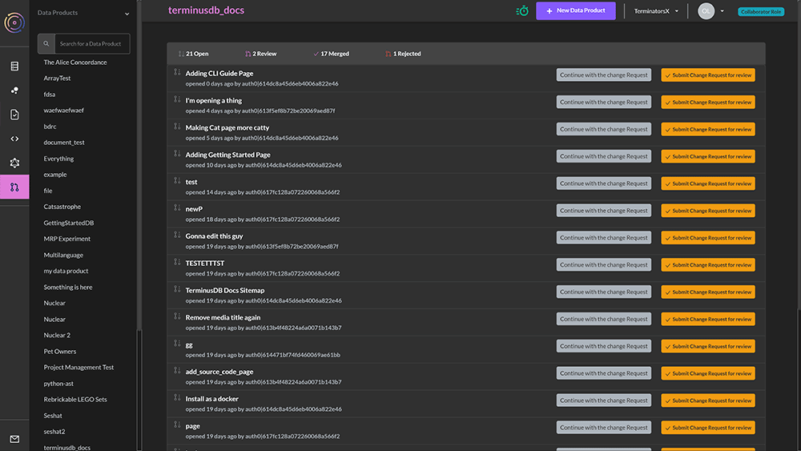
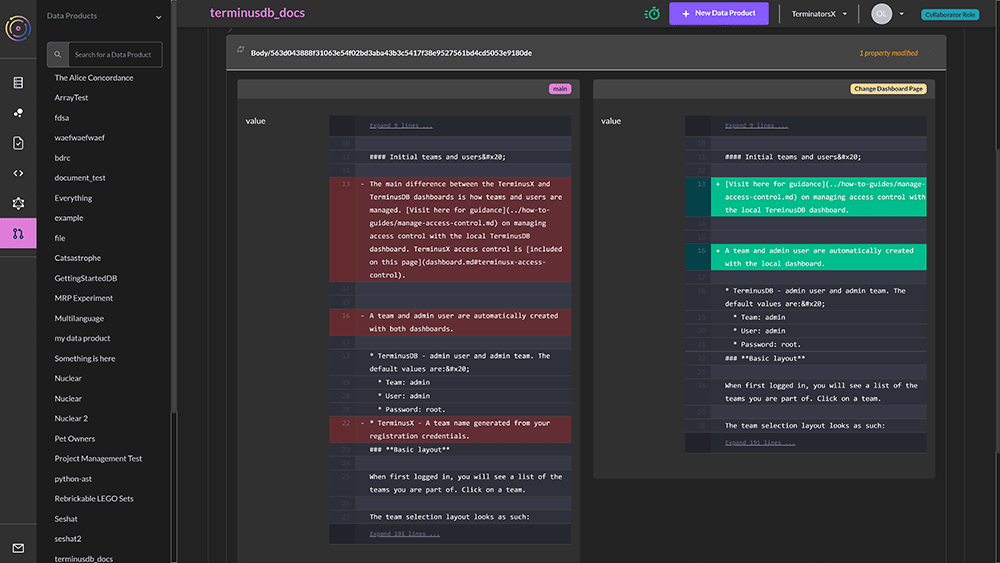
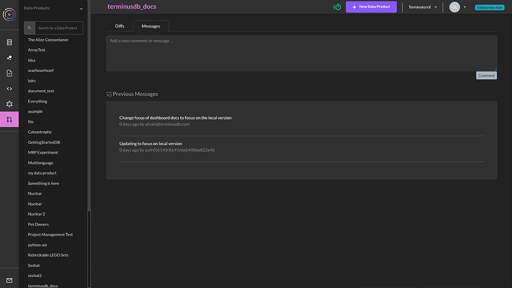
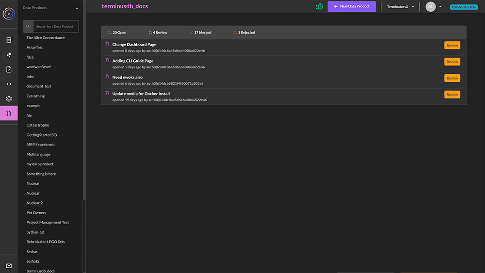
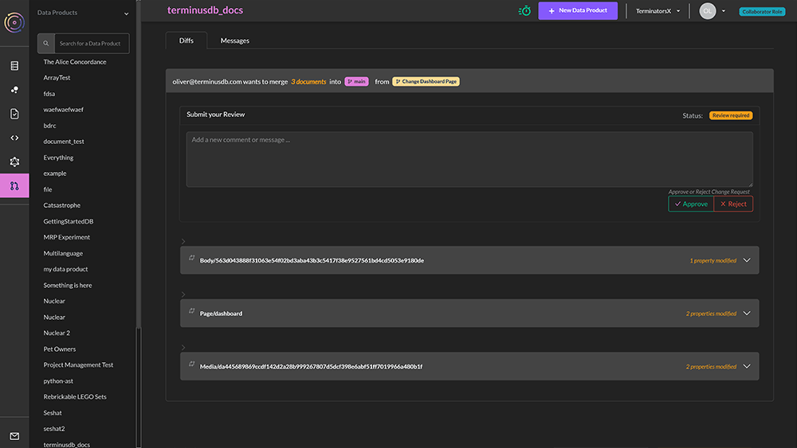

# Change Request Workflows

TerminusCMS features change request workflows to ensure that changes to data and content are made safely with reviews in place to check changes.

### Creating a Change Request

When someone goes to make a change to content and data, TerminusCMS automatically opens a change request. This is a branch of the database that does not impact main. Users can make one or many changes within the change request -

<figure><figcaption></figcaption></figure>

### In a Change Request

Users will see when they are in a change request. A banner with various options is included at the top of the page and there is also a notice on the left informing the user what they are connected to -

<figure><figcaption></figcaption></figure>


It is important to submit edits or additions in a change request. Without hitting the submit button, changes will not be saved to the change request.


When in a change request a user has three options -

1. Continue to make edits, deletions, and additions to the change request.
2. Exit the change request - This leaves the change request open and available to come back to at a later stage.
3. Submit the change request for review.

### Change Request Admin

Change requests are managed from the change request screen.&#x20;

<figure><figcaption></figcaption></figure>

The screen has four tabs -

1. Open - Open change requests that can be continued with or submitted for review.
2. Review - Change requests that have been submitted for review.
3. Merged - Previous approved commits to the database.
4. Rejected - Rejected change requests.

### Review Change Requests

On the change request screen, select review. Change requests that users have submitted for review are listed in chronological order.

<figure><figcaption></figcaption></figure>

 

<figure><figcaption></figcaption></figure>

 

<figure><figcaption></figcaption></figure>

 

<figure><figcaption></figcaption></figure>

To review a change request, do the following -

* Click the 'review' button for the corresponding change request.
* The next screen has all of the details of the change request with two tabs -
  * The first is the diff view with drop-down options to display the changes that have been made.
  * The second is the messages tab, this displays the messages entered when creating and submitting the change request and can provide context.&#x20;
* Users can either accept or reject a change request and leave a message explaining their reasoning behind each.
* Accepted change requests will move the change request into the merged tab - users are able to view the diff to see the changes of past commits.
* Rejected change requests move into the rejected tab on the change request home screen.

### Conflicts & Collaboration

In order to avoid changes being squashed by other users when multiple people make changes to data and content, TerminusCMS checks the database to see if there have been changes made before a user reviews and merges a change request.

In order to proceed. The user must rebase their change request to incorporate the latest changes into their own change request. A prompt tells the user what to do. &#x20;
