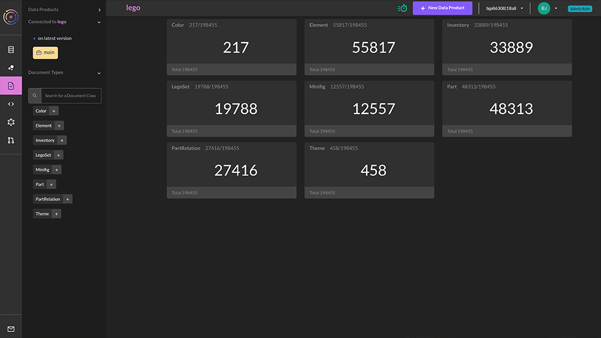
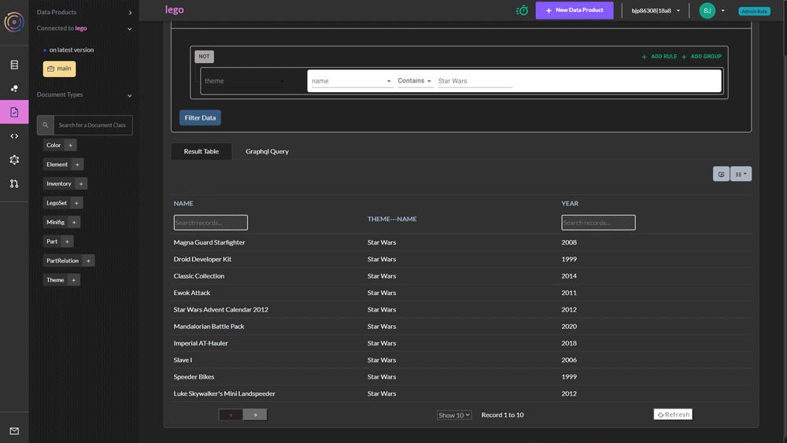
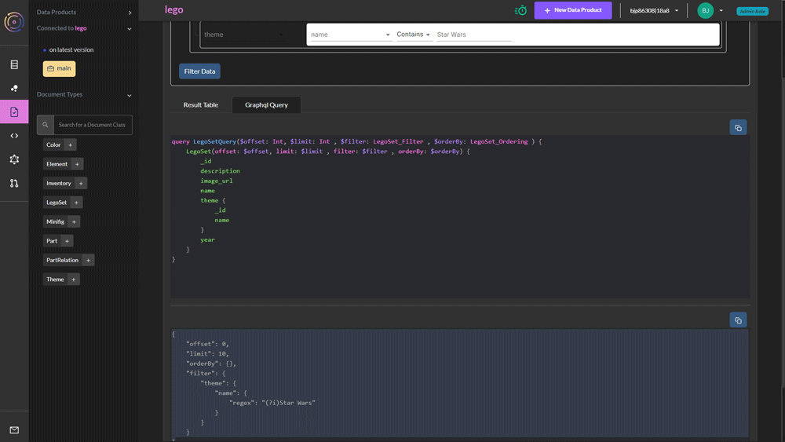
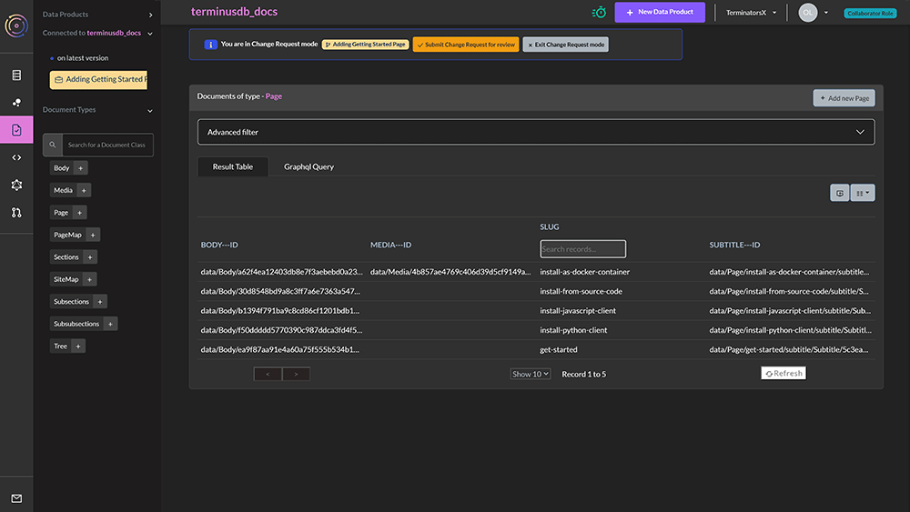
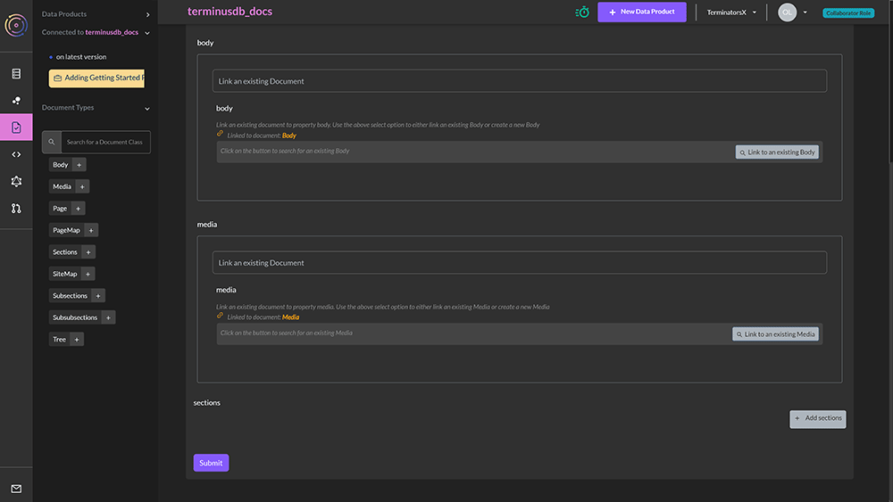
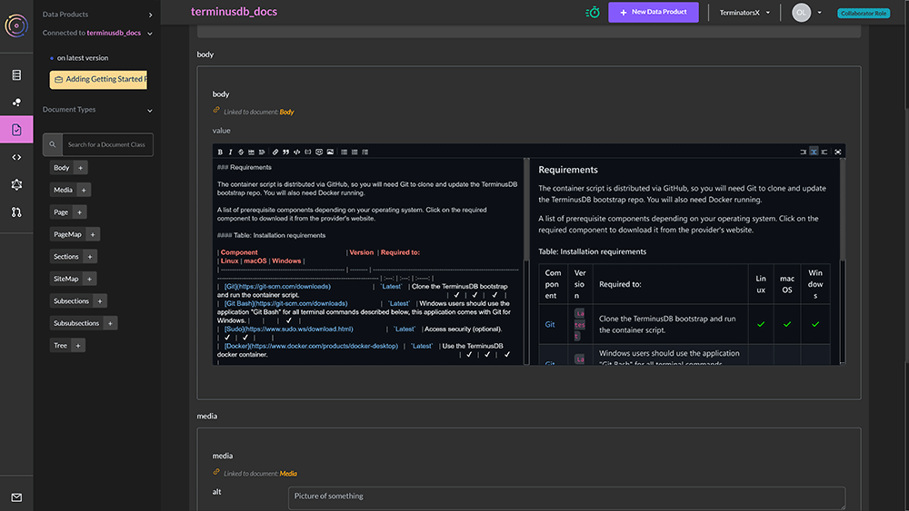
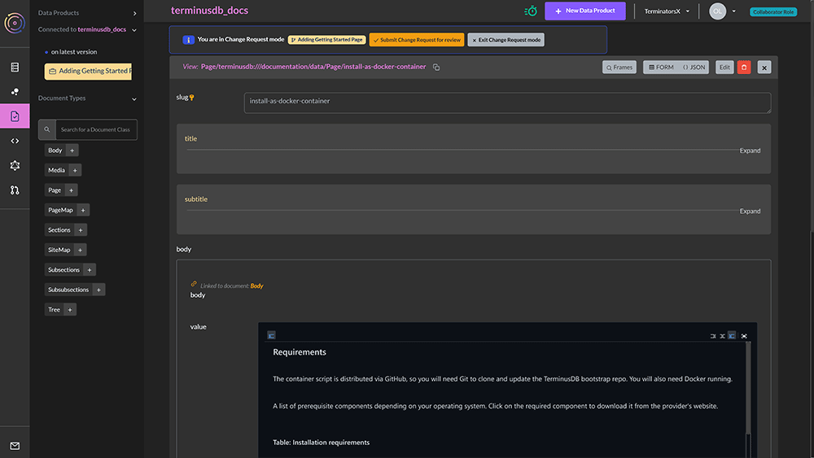

# Content & Data Curation

TerminusCMS automatically generates document editing frames from the schema. Users can then add, edit, and delete content and data as needed.

First, navigate to the document explorer from the left menu -

<figure><figcaption></figcaption></figure>

The document explorer lists all of the document types within the schema and displays how many of each there are.

The left-hand menu also details the document names with the ability to search for something specific.&#x20;

### Filtering and Searching Documents

Clicking on a document type displays a list of matching documents -

<figure><figcaption></figcaption></figure>

&#x20;The document table allows users to -

* Choose the properties to display in the table
* Search properties
* Perform advanced filters

### GraphQL Query

The GraphQL tab provides front-end developers with an overview of the GraphQL query structure of the document and includes JSON-LD details for applied filters -

<figure><figcaption></figcaption></figure>

### Adding, Editing, & Deleting Docs

In order to make changes to content and data, users need to create a change request. This is automated when selecting to edit, delete, or add content. Please refer to the [change request workflows section](change-request-workflows.md) for full details.

A change request dialogue box opens and prompts the user to add a change request title and description. They can then go and make changes.

#### Adding Content & Data

To add content and data, either click on the + symbol next to the document type name from the left menu or select the 'add new' button from the document explorer page -

<figure><figcaption></figcaption></figure>

The document editing frame is generated from the schema and this includes things like -

* Validation
* Localization
* Markdown
* Property types such as data, currency, and lists.

The editing interface can also include links to other documents and subdocuments and this is all specified in the schema. The example below is a test project working on the TerminusDB documentation and features links to other document types.&#x20;

A page for example can link to sections and a body so the same piece of content can be used in multiple locations. The schema can also specify that the linked document types unfolded so they display ready for editing within a piece of content -

<figure><figcaption></figcaption></figure>

 

<figure><figcaption></figcaption></figure>

For details on how to specify markdown, unfolded, and other properties within the schema, please read the [schema reference guide](../../guides/reference-guides/python-client-reference/terminusdb\_client.schema.md).

#### Editing and Deleting Content & Data

To edit a document, select the document to edit by clicking on it from the document explorer. This will open up the document for editing.

Make the changes and ensure to press select submit to ensure changes are saved.

<figure><figcaption></figcaption></figure>

To delete a document, select the red bin icon. A warning message will display to confirm the deletion.

