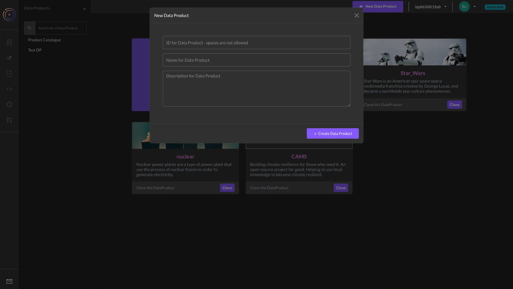
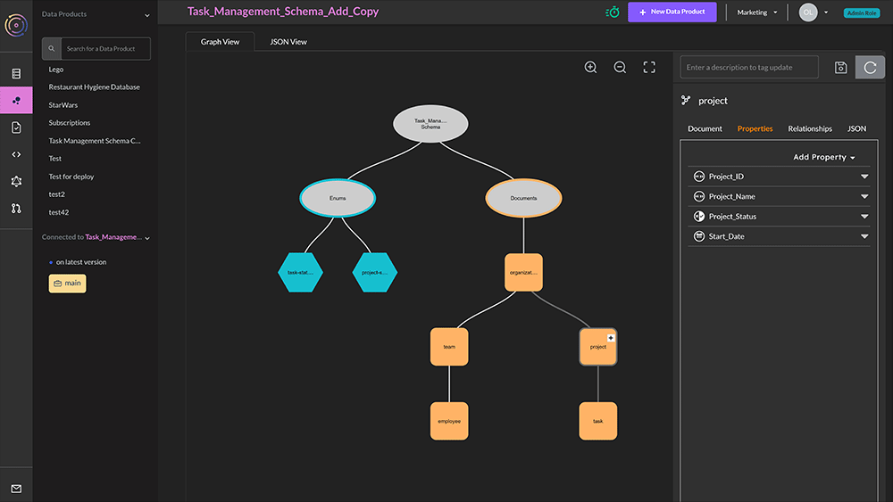
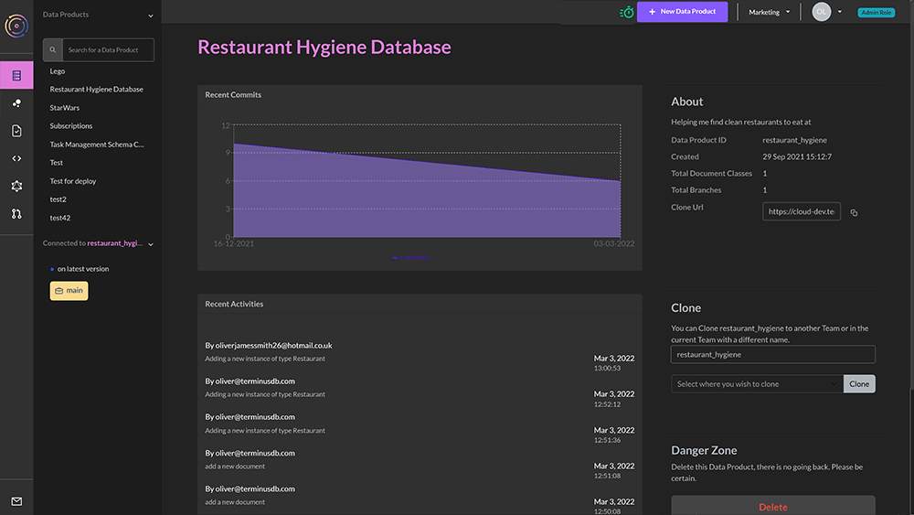
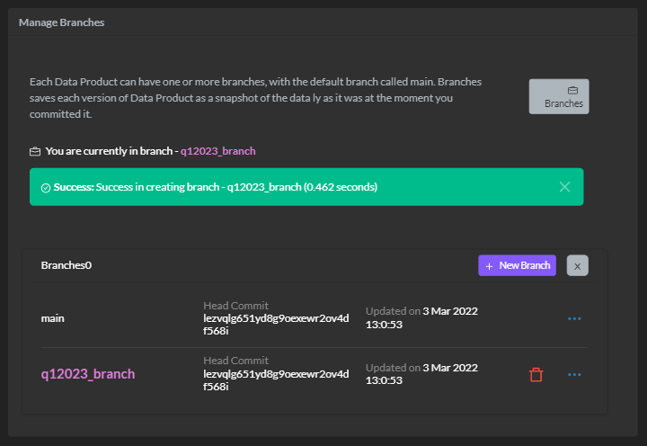
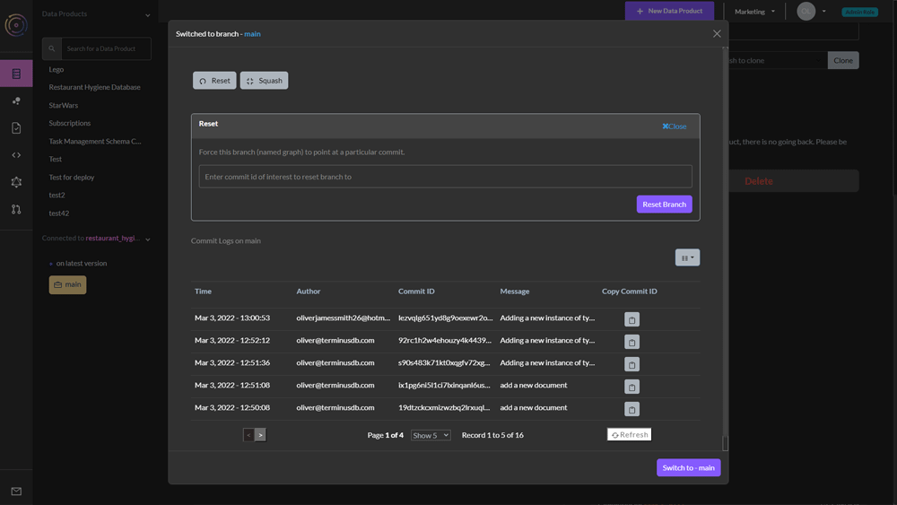

# Projects/Data Products

### Create a new data product

Creating a data product by -

1. Select ‘New Data Product’&#x20;
2. Give it an ID (only alphanumeric characters and underscores are allowed)&#x20;
3. Name it something meaningful&#x20;
4. Give it a description so that team members can see its purpose.

<figure><figcaption></figcaption></figure>

All projects/data products within a team are listed on the left.&#x20;

Select the data product by clicking it.

### Adding a Schema

Build a project's schemas using the user interface or develop it in code.&#x20;

For a detailed overview of the schema language, which is based on JSON syntax refer to the [schema reference guide](../../guides/reference-guides/schema.md).

#### Visual Interface

<figure><figcaption></figcaption></figure>

1. Choose Data Product Model from the lefthand menu - the second icon.&#x20;
2. In the window, you will see an oval called your data product name schema. Click on the oval and select the + symbol.&#x20;
3. Add a document or enum.&#x20;
   * JSON documents form the nodes of the graph&#x20;
   * Enumerated types are a set of possible choices&#x20;
4. Select add document.&#x20;
5. On the right, you will see a set of options to define the document:&#x20;
   * Give it a unique ID (no spaces)&#x20;
   * Define the document key, choose from ([this blog will help you decide what key to use](https://terminusdb.com/blog/uri-generation/)):&#x20;
     * Lexical (need to set up document properties first)&#x20;
     * Hash (need to set up document properties first)&#x20;
     * Random&#x20;
     * ValueHash
6. Add the document properties, choose from:&#x20;
   * Enum - Need to create the enums before this option becomes available&#x20;
   * Numeric&#x20;
   * String&#x20;
   * Geo&#x20;
   * Temporal&#x20;
   * Boolean&#x20;
   * JSON&#x20;
   * Link - building the relationships in the graph&#x20;
7. On the next tab, you can see the relationships in the graph, this will show links between objects. You can also set the document as a parent/child of another document.&#x20;
8. The final tab when creating the document shows it in its JSON format.&#x20;
9. Save your document by clicking on the disk icon.

Creating subdocuments and enums can be achieved in much the same way.

#### Schema as Code

<figure><figcaption></figcaption></figure>

Using a visual editor to build a schema isn’t for everybody. Users can also design schema as code.&#x20;

1. Choose Data Product Model from the lefthand menu - the second icon.&#x20;
2. In the window, there are two tabs, ‘Graph View’ and ‘JSON View’.&#x20;
3. Select JSON View.&#x20;
4. Click on the edit icon.&#x20;
5. Add or copy and paste the JSON schema into the window and save.

The schema should now display in the graph view.

### Version Control Features

TerminusCMS has collaboration and version control features. Some of these are available via the dashboard. From the left select the first icon to navigate to your project home page -

<figure><figcaption></figcaption></figure>

On this page, you can -

* See a snapshot of the latest activities.
* See the project details.
* Clone the project - name it and decide which team you want to clone it to.
* Delete the project.
* Branch the project - along with reset and squash.
* Time travel to any previous commit to inspect the project in the past.

<figure><figcaption></figcaption></figure>

### Branch Projects

At the bottom of the project home page is the branch button.

<figure><figcaption></figcaption></figure>

Each project can have one or more branches, the default is called main. Each branch contains a snapshot of the data as it was at the time of branching. This is useful for experimenting or providing data to other teams when you want to keep them away from main.

Users can reset a branch to a specific commit or can delete the commit history by squashing it. They do this by selecting the ellipsis symbol next to the branch and then following the prompts.&#x20;

<figure><figcaption></figcaption></figure>

### Reset Project

TerminusCMS enables users to reset the project database to a particular commit. To do this, scroll to the bottom of the project home page and click branches.

Select the ellipsis symbol next to main. Here users can reset to a specific commit, or delete the commit history by squashing it.

<figure><figcaption></figcaption></figure>

###

